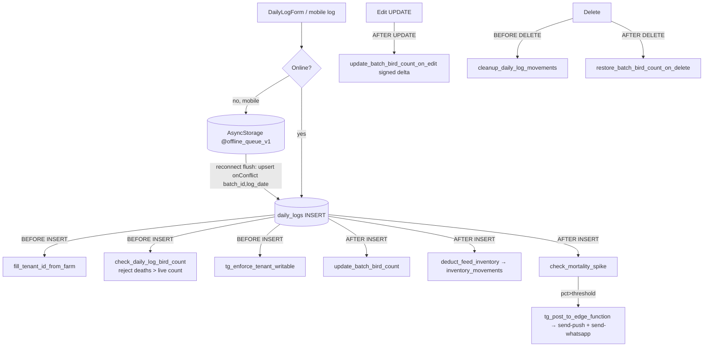

# Module 3 — Daily Log (+ offline queue) · Audit Report

**Audited:** 2026-06-18 · against real code + live Supabase project `jusxngbfdmzhlybohell`.
**Status:** ✅ Complete — frontend hardening applied; 1 P1 trigger-binding fix proposed.

---

## Flow map



## Trigger bindings (verified from live `pg_trigger`)
| When | Trigger | Function |
|------|---------|----------|
| BEFORE INSERT | tg_0_daily_logs_fill_tenant | fill_tenant_id_from_farm |
| BEFORE INSERT | tg_daily_logs_check_bird_count | **check_daily_log_bird_count** (INSERT only) |
| BEFORE INSERT | tg_daily_logs_writable | tg_enforce_tenant_writable (read-only gate when unpaid/suspended) |
| AFTER INSERT | tg_daily_logs_update_bird_count | update_batch_bird_count |
| AFTER INSERT | tg_daily_logs_deduct_feed | deduct_feed_inventory |
| AFTER INSERT | tg_daily_logs_check_mortality | check_mortality_spike |
| BEFORE UPDATE | tg_daily_logs_updated_at | tg_set_updated_at |
| AFTER UPDATE | tg_daily_logs_update_bird_count_edit | update_batch_bird_count_on_edit |
| BEFORE DELETE | tg_daily_logs_cleanup_movements | cleanup_daily_log_movements |
| AFTER DELETE | tg_daily_logs_restore_bird_count | restore_batch_bird_count_on_delete |

## What's correct (verified)
- **Insert guard** locks the batch row `FOR UPDATE` and rejects `birds_dead > current_bird_count`.
- **Count math** floors at `GREATEST(0, …)`; edit uses a **signed delta**; delete **restores** the count.
- **Mortality spike** keys off `opening_bird_count` vs `farms.mortality_alert_threshold_pct`
  (default 1.0%); fans out to push + WhatsApp via `tg_post_to_edge_function`.
- **Offline queue** flushes with `upsert(onConflict: batch_id,log_date)` → last-write-wins, no
  loss; per-row `attempts` capped at `MAX_ATTEMPTS=5`, failures stay visible (verified in
  `mobile-app/lib/offline-queue.ts`).
- **Web edit form** deliberately makes feed **read-only** and tells the user to correct stock via
  an inventory adjustment — neatly avoids feed/inventory drift on edit.

## Issues found

| ID | Sev | Area | Finding |
|----|-----|------|---------|
| **D1** | P2 | Frontend | Both forms accepted **future-dated** logs (`log_date` only `min(1)`), which skews age/KPIs. No placement-date floor either. |
| **D2** | **P1** | DB / data integrity | **Edits bypass the mortality guard.** `check_daily_log_bird_count` already computes the UPDATE delta (`NEW.birds_dead - OLD.birds_dead`) but is bound **BEFORE INSERT only**. So editing a log's `birds_dead` to an impossible number is accepted and `current_bird_count` silently floors to 0. The insert path is protected; the edit path is not. |
| D3 | P2 | Sync semantics | On the offline `upsert`-as-UPDATE path (a queued row overwriting an existing online row for the same day), the AFTER-INSERT triggers don't fire → no **feed re-deduct**, no **mortality-spike alert**, and the BEFORE-INSERT count guard is skipped (D2). Rare (collision-only) and last-write-wins by design, but asymmetric. |
| D4 | P2 | UX | Duplicate `(batch_id, log_date)` on the web insert surfaces the raw Postgres unique-violation text instead of "a log already exists for this date — edit it." |

## Fixes applied this pass (frontend, in-scope)

### D1 — Block future-dated logs ✅
`daily-log/new/DailyLogForm.tsx` + `daily-log/[id]/edit/EditDailyLogForm.tsx`: `log_date` zod
now `.refine(v => v <= today)` and the date input carries `max={today}`.
**Verification:** `tsc --noEmit` → exit 0, 0 errors.

## Proposed (NOT applied — DB, awaiting approval)

### D2 — Validate mortality on edit (one trigger binding; function unchanged)
```sql
-- check_daily_log_bird_count already handles the UPDATE branch (signed delta);
-- it just needs to be wired to BEFORE UPDATE as well. At edit time current_bird_count
-- still reflects the pre-edit state, so the delta check is correct.
create trigger tg_daily_logs_check_bird_count_edit
  before update on public.daily_logs
  for each row execute function public.check_daily_log_bird_count();
```
After this, increasing `birds_dead` beyond the live count on an edit is rejected, matching insert.

### D3 (optional) — alert/inventory parity on edit
If product wants mortality alerts + feed reconciliation to also reflect edits, add AFTER UPDATE
handling (re-run spike check on `birds_dead` increase; reconcile feed via adjustment). Lower
priority — current web edit UX already steers feed corrections to inventory adjustments.

## Enterprise SaaS gap notes (Phase 5)
- ✅ Strong: offline-first core entry, atomic trigger cascade, mortality fan-out, idempotent queue.
- ➖ Thin: edit-path validation parity (D2); future-date guard was client-only until now (consider
  a DB CHECK `log_date <= current_date` for defense-in-depth); no per-edit audit of who changed a log.

## Completion gate
✅ Flow mapped (triggers verified from live `pg_trigger`) · ✅ Frontend audited + D1 fixed,
typecheck-clean · ✅ Offline queue reviewed · ✅ RLS/read-only gate present · ✅ Documented;
D2 trigger-binding fix proposed (not applied) per operating mode.
