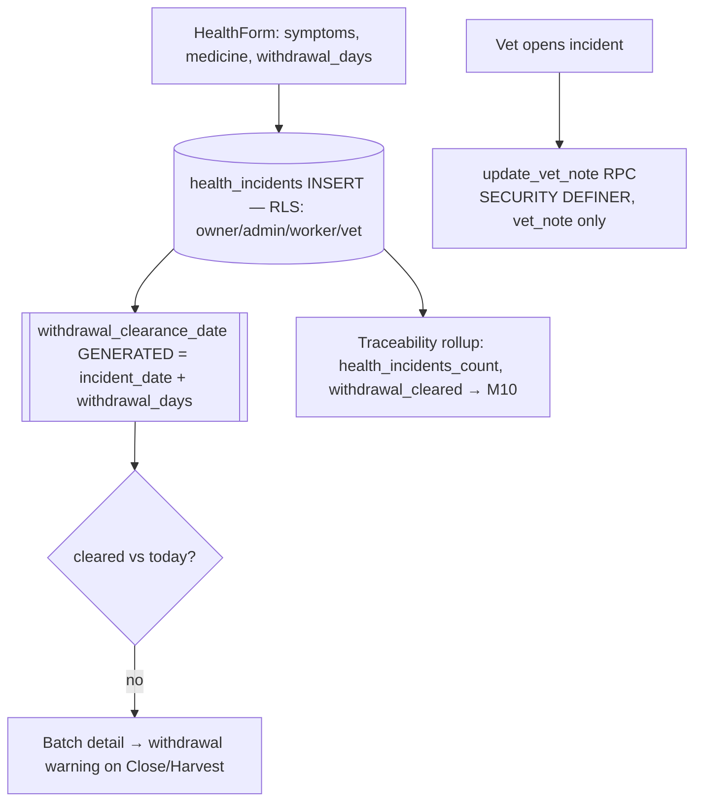

# Module 4 — Health Incidents & Withdrawal · Audit Report

**Audited:** 2026-06-18 · against real code + live Supabase project `jusxngbfdmzhlybohell`.
**Status:** ✅ Complete — 3 frontend fixes applied; 1 RLS narrowing proposed.

---

## Flow map



## Backend touchpoints (verified)
- **Table `health_incidents`:** `withdrawal_clearance_date` is **GENERATED ALWAYS** =
  `incident_date + withdrawal_days` (verified) — cannot be forged directly.
- **RPC `update_vet_note(p_incident_id, p_note)`:** SECURITY DEFINER, checks `farm_users.role IN
  ('vet','owner')`, writes **only** `vet_note`. Correct — but **was not being called** (see H1).
- **RLS:** SELECT/INSERT = owner/admin/worker/vet (member-scoped); DELETE = owner/admin;
  UPDATE (`health_incidents_modify`) = owner/admin/**vet**, **with no column restriction**.

## Issues found

| ID | Sev | Area | Finding |
|----|-----|------|---------|
| **H1** | **P1** | Security / spec | **Vet can edit the whole row.** `VetNoteForm` did a raw `update({vet_note})` and the UPDATE policy grants vets table-wide write, so a vet could change `withdrawal_days` (→ alters the GENERATED clearance date), `diagnosis`, `affected_bird_count`, etc. The column-restricted `update_vet_note` RPC existed but was unused. Contradicts the "vet: note only" model. |
| **H2** | **P1** | Food safety | **No withdrawal check at sale.** `close_batch` / `record_harvest` never consult `withdrawal_clearance_date`, so birds can be sold mid-withdrawal. Withdrawal data was informational only. |
| H3 | P2 | Frontend | `HealthForm` accepted **future** `incident_date` and an `affected_bird_count` exceeding the live flock. |
| H4 | P2 | UX | No reminder when a withdrawal period is about to clear (could WhatsApp the owner). |

## Fixes applied this pass (frontend, in-scope)

### H1 — Route vet edits through the guarded RPC ✅
`health/[id]/VetNoteForm.tsx`: now calls `supabase.rpc('update_vet_note', { p_incident_id, p_note })`
instead of a raw table UPDATE. Vets write **only** `vet_note`, via the membership-checked RPC.
*(Full closure needs the RLS narrowing below — proposed.)*

### H2 — Withdrawal warning before any sale ✅
`batches/[id]/page.tsx` computes the latest un-cleared `withdrawal_clearance_date` from the
batch's incidents and passes a `withdrawalWarning` to both `CloseBatchForm` and `HarvestForm`,
which render a red ⚠ banner: *"Birds are under medicine withdrawal until DD-Mon-YYYY — do not
sell for human consumption before then."* Non-blocking (owner may still sell unaffected birds),
but the risk is now surfaced at the point of sale.

### H3 — Incident input sanity ✅
`health/new/HealthForm.tsx`: `incident_date <= today` (zod refine + `max`); rejects
`affected_bird_count > current_bird_count`.

**Verification:** `tsc --noEmit` → exit 0, 0 errors (all files).

## Proposed (NOT applied — DB, awaiting approval)

### H1 — Narrow direct UPDATE to owner/admin (vets use the RPC)
```sql
drop policy health_incidents_modify on public.health_incidents;
create policy health_incidents_modify on public.health_incidents
  for update
  using      (is_tenant_member(tenant_id) and (is_tenant_admin(tenant_id) or is_farm_owner(farm_id)))
  with check (is_tenant_member(tenant_id) and (is_tenant_admin(tenant_id) or is_farm_owner(farm_id)));
```
Safe to apply now that `VetNoteForm` uses `update_vet_note` (SECURITY DEFINER bypasses RLS).

### H2 (optional) — DB-level withdrawal guard
A hard block in `record_harvest`/`close_batch` when an incident's withdrawal hasn't cleared is
possible, but may be too strict (selling unaffected birds is legitimate). Recommend keeping the
**warning** + optionally requiring an override reason logged to notes, rather than an outright block.

### H4 (optional) — withdrawal-clearing reminder
A daily cron could WhatsApp the owner the day a withdrawal period clears (reuse
`send-whatsapp-message`). Low priority.

## Enterprise SaaS gap notes (Phase 5)
- ✅ Strong: generated (un-forgeable) clearance date; dedicated column-restricted vet RPC; full RLS.
- ➖ Thin: RLS column scope for vet (H1); sale-time enforcement is advisory (H2); no withdrawal
  reminder automation (H4); vet edits aren't separately audited from owner edits.

## Completion gate
✅ Flow mapped · ✅ Frontend audited + 3 fixes applied, typecheck-clean · ✅ RLS + generated
column + vet RPC verified from live DB · ✅ Food-safety risk surfaced at sale · ✅ Documented;
RLS narrowing proposed (not applied) per operating mode.
