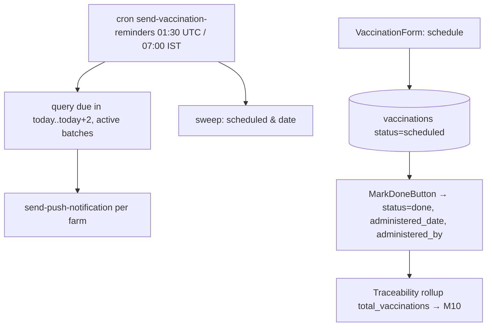

# Module 5 — Vaccinations · Audit Report

**Audited:** 2026-06-18 · against real code + live Supabase project `jusxngbfdmzhlybohell`.
**Status:** ✅ Complete — 1 frontend fix applied; 2 Edge-Function fixes proposed (one P1).

---

## Flow map



## Backend touchpoints (verified)
- **Table `vaccinations`:** `status` default `'scheduled'`; **no trigger** flips to `overdue` —
  the cron does it. RLS: SELECT = any farm member; INSERT/UPDATE/DELETE = **owner/admin only**.
- **Cron `send-vaccination-reminders`:** service-role auth; (1) sweeps overdue, (2) queries
  due-soon, (3) one **push per farm**. Verified source in `supabase/functions/.../index.ts`.

## Issues found

| ID | Sev | Area | Finding |
|----|-----|------|---------|
| **V1** | **P1** | Edge / reminders | **Overdue doses are never reminded again.** The sweep sets `status='overdue'` for rows with `scheduled_date < today`; the due-soon query then filters `scheduled_date >= today`, so **no overdue row can ever match it**. The `status IN ('scheduled','overdue')` clause is dead. A missed vaccine is marked overdue once and then silently dropped from all future reminders. |
| **V2** | **P1** | Edge / parity | **WhatsApp reminder is never sent.** Docs/CLAUDE say vaccination reminders pair push **+ WhatsApp** (`vaccination_reminder` template), but the cron only POSTs to `send-push-notification`. No `send-whatsapp-message` call exists. |
| V3 | P2 | Frontend | `MarkDoneButton` recorded `status` + `administered_date` but **not `administered_by`** — losing the audit/traceability of who gave the dose. |
| V4 | P2 | RLS / UX | UPDATE is owner/admin only, so a **worker cannot "Mark done"** a vaccine they administered. May be intentional; flag for product. |
| V5 | P2 | Product | No per-breed default vaccination schedule seeding — every dose is entered manually. |

## Fixes applied this pass (frontend, in-scope)

### V3 — Record who administered ✅
`vaccinations/MarkDoneButton.tsx`: now fetches the current user and writes `administered_by`
alongside `status='done'` + `administered_date`.
**Verification:** `tsc --noEmit` → exit 0, 0 errors.

## Proposed (NOT applied — Edge Function, awaiting approval)

### V1 — Keep reminding overdue doses (the headline fix)
In `send-vaccination-reminders/index.ts`, the due query must include overdue rows. Drop the
`>= today` lower bound (optionally bound to a recent lookback to avoid nagging forever):
```ts
// before: .in('status',['scheduled','overdue']).gte('scheduled_date', todayStr).lte('scheduled_date', plusTwoStr)
const lookbackStr = new Date(today.getTime() - 14 * 864e5).toISOString().slice(0, 10);
const { data: dueRows } = await supabase
  .from('vaccinations')
  .select('id, vaccine_name, scheduled_date, farm_id, batches!inner(batch_code, status)')
  .in('status', ['scheduled', 'overdue'])
  .gte('scheduled_date', lookbackStr)   // include recently-overdue
  .lte('scheduled_date', plusTwoStr);
```
This makes overdue doses keep generating reminders (push, and WhatsApp once V2 lands).

### V2 — Actually send the WhatsApp reminder
Add a `send-whatsapp-message` POST per farm alongside the push, with
`event: 'vaccination_reminder'` and the approved template fields (`vaccine_name`,
`scheduled_date`, `batch_code`). The central sender already enforces per-category opt-out and the
free-tier WhatsApp cap concerns (see M13).

## Enterprise SaaS gap notes (Phase 5)
- ✅ Strong: service-role-only cron auth; per-farm batching; active-batch filter; idempotent sweep.
- ➖ Thin: overdue follow-up reminders (V1); WhatsApp channel not wired (V2); no administered_by
  until now (V3); no schedule templates (V5); worker can't self-serve mark-done (V4).

## Completion gate
✅ Flow mapped · ✅ Cron source + RLS + schema read from live DB · ✅ Frontend audited + V3 fixed,
typecheck-clean · ✅ Documented; V1 (P1) + V2 Edge-Function fixes proposed (not applied) per
operating mode.
