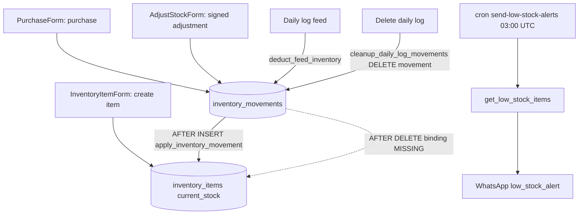

# Module 6 — Inventory & Feed Auto-Deduct · Audit Report

**Audited:** 2026-06-18 · against real code + live Supabase project `jusxngbfdmzhlybohell`.
**Status:** ✅ Complete — 1 frontend guard applied; 1 P1 trigger-binding fix proposed.

---

## Flow map



## Backend touchpoints (verified)
- **`apply_inventory_movement`** (trigger fn): on non-DELETE applies a signed delta —
  `usage` subtracts, `purchase`/`adjustment` add `NEW.quantity` (adjustments carry a **signed**
  quantity, so a downward correction inserts a negative — consistent with `+ NEW.quantity`).
  Floors at `GREATEST(0, …)`. It **also has a correct DELETE-reversal branch**.
- **Trigger bindings (verified `pg_trigger`):** `tg_inventory_movements_apply` = **AFTER INSERT
  only**. No AFTER DELETE / AFTER UPDATE binding.
- **`get_low_stock_items(p_farm_id)`**: clean SQL (`current_stock <= low_stock_threshold`,
  `threshold > 0`). Used by the low-stock cron.
- **RLS:** tenant + writable-gate triggers present on both tables.

## Issues found

| ID | Sev | Area | Finding |
|----|-----|------|---------|
| **I1** | **P1** | DB / inventory integrity | **Movement deletions don't restore stock.** `apply_inventory_movement` has a DELETE branch but is bound **AFTER INSERT only**, so the branch is dead code. When `cleanup_daily_log_movements` deletes a feed-usage movement (on daily-log deletion), or any movement is removed, `current_stock` is **not** added back — stock silently drifts low. The flow doc's "reverses its usage movement" is currently false. |
| I2 | P2 | Frontend | `PurchaseForm` allowed **future-dated** purchases (no `max`). |
| I3 | P2 | Product | Medicine/vaccine stock isn't auto-deducted by health/vaccination entries (feed-only auto-deduct). |
| I4 | P2 | Accuracy | Feed match in `deduct_feed_inventory` is `item_name LIKE feed_type||'%'`; no matching item → silent no-op. Already mitigated: `DailyLogForm` warns the user when no feed item matches (verified in M3). |

## Fixes applied this pass (frontend, in-scope)

### I2 — Block future-dated purchases ✅
`inventory/purchase/PurchaseForm.tsx`: `movement_date` now `.refine(v => v <= today)` + `max` on input.
**Verification:** `tsc --noEmit` → exit 0, 0 errors.

## Proposed (NOT applied — DB, awaiting approval)

### I1 — Bind the DELETE reversal (function already correct)
```sql
-- apply_inventory_movement already handles TG_OP='DELETE' (restores stock).
-- It is simply not wired to AFTER DELETE. Add the binding:
create trigger tg_inventory_movements_apply_delete
  after delete on public.inventory_movements
  for each row execute function public.apply_inventory_movement();
```
After this, deleting a daily log (→ `cleanup_daily_log_movements`) correctly returns feed to stock,
and manual movement deletions self-correct. **Do NOT** add an AFTER UPDATE binding — the function
has no UPDATE branch (would double-count); movements should stay immutable.

### I3 (optional) — medicine/vaccine deduction
Mirror `deduct_feed_inventory` for `health_incidents.medicine_name` / `vaccinations` against
`category IN ('medicine','vaccine')` items, if stock tracking for those is wanted.

## Enterprise SaaS gap notes (Phase 5)
- ✅ Strong: stock is derived purely from an append-only movement ledger (audit trail); signed
  adjustments; low-stock RPC + cron; floors at 0.
- ➖ Thin: delete-reversal not wired (I1) — undermines the "pure ledger" guarantee; medicine/vaccine
  not auto-deducted (I3); no stock-take reconciliation against `physical_counts` here (see M16).

## Completion gate
✅ Flow mapped (bindings verified from live `pg_trigger`) · ✅ Frontend forms audited + I2 fixed,
typecheck-clean · ✅ Trigger fn + low-stock RPC read from live DB · ✅ Documented; I1 (P1)
trigger-binding fix proposed (not applied) per operating mode.
