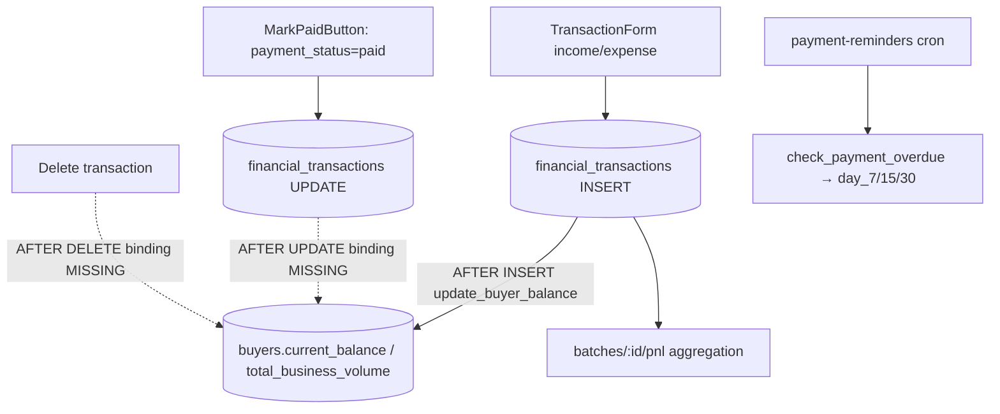

# Module 7 — Transactions (Income / Expense) · Audit Report

**Audited:** 2026-06-18 · against real code + live Supabase project `jusxngbfdmzhlybohell`.
**Status:** ✅ Complete — 1 frontend guard applied; **1 high-impact P1 trigger-binding fix proposed**.

---

## Flow map



## Backend touchpoints (verified)
- **`update_buyer_balance`** (trigger fn): recomputes a buyer's `current_balance`,
  `total_business_volume`, `last_transaction_date` by **summing all that buyer's transactions**.
  Uses `COALESCE(NEW.buyer_id, OLD.buyer_id)` — **explicitly written for INSERT/UPDATE/DELETE.**
  Outstanding logic: paid→0, partial→`amount - COALESCE(amount_paid, amount*0.5)`, pending→`amount - COALESCE(amount_paid,0)`.
- **`check_payment_overdue`** (used by reminders cron): outstanding > 0 + due past + stage
  day_7/15/30 + not-already-reminded. Correct; partial uses recorded `amount_paid` (0.5 fallback only when null).
- **Trigger bindings (verified `pg_trigger`):** `tg_financial_tx_update_buyer_balance` =
  **AFTER INSERT only**. No UPDATE/DELETE binding.
- **RLS:** money tables owner-only (workers/vets excluded).

## Issues found

| ID | Sev | Area | Finding |
|----|-----|------|---------|
| **T1** | **P1** | DB / receivables | **Buyer balance never recomputes on UPDATE or DELETE.** The trigger is bound AFTER INSERT only, yet `update_buyer_balance` is built for all three ops. So **"Mark paid" (an UPDATE) does not reduce the buyer's balance** — the Khata ledger keeps showing the receivable as outstanding after payment. Editing the amount or deleting a transaction likewise leave a stale balance. Directly breaks Khata receivables (M8). |
| T2 | P2 | Frontend | `TransactionForm` allowed **future-dated** transactions (skews receivables aging / P&L period). |
| T3 | P2 | DB / edge case | On UPDATE that **reassigns `buyer_id`** (A→B), the function only recomputes for the new buyer; buyer A is left stale (recompute path keys off `COALESCE(NEW,OLD)` = NEW). |
| T4 | P2 | Resolved | Historical `partial = 0.5` math: `TransactionForm` now requires `amount_paid ∈ (0, amount)` for partial and the functions use it; 0.5 is only a fallback for rows missing `amount_paid` (e.g. legacy/mobile). |

## Fixes applied this pass (frontend, in-scope)

### T2 — Block future-dated transactions ✅
`transactions/new/TransactionForm.tsx`: `transaction_date` now `.refine(v => v <= today)` + `max` on input.
**Verification:** `tsc --noEmit` → exit 0, 0 errors.

## Proposed (NOT applied — DB, **recommend applying ASAP**)

### T1 — Recompute buyer balance on UPDATE + DELETE (function already correct & idempotent)
```sql
create trigger tg_financial_tx_update_buyer_balance_ud
  after update or delete on public.financial_transactions
  for each row execute function public.update_buyer_balance();
```
This makes "Mark paid", edits, and deletes correctly recompute `buyers.current_balance`.
*(MarkPaidButton needs no change — once the trigger fires on UPDATE, marking paid drives the
buyer's outstanding to 0 via the `payment_status='paid' → 0` branch.)*

### T3 (optional) — handle buyer reassignment
If buyer_id reassignment is allowed on edit, recompute **both** old and new buyer. Either a
statement-level recompute of distinct affected buyers, or guard edits so `buyer_id` is immutable.

## Enterprise SaaS gap notes (Phase 5)
- ✅ Strong: full money RLS (owner-only); ledger-style buyer balance recompute; staged overdue logic;
  amount_paid captured for partials.
- ➖ Critical: stored balance only refreshes on insert (T1) — the single biggest correctness gap so
  far, because it silently misreports receivables. ➖ No recurring/expense templates.

## Completion gate
✅ Flow mapped (bindings verified from live `pg_trigger`) · ✅ Frontend audited + T2 fixed,
typecheck-clean · ✅ Buyer-balance + overdue functions read from live DB · ✅ Documented; **T1 (P1)
trigger-binding fix proposed — flagged as the top apply-now item.**
