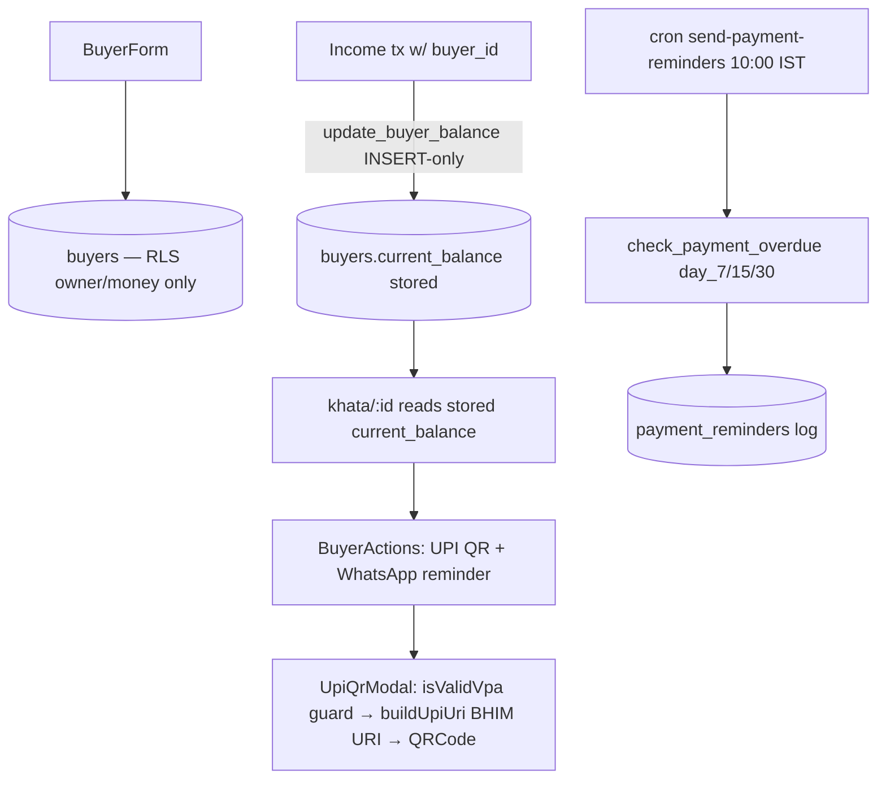

# Module 8 — Khata / UPI · Audit Report

**Audited:** 2026-06-18 · against real code + live Supabase project `jusxngbfdmzhlybohell`.
**Status:** ✅ Complete — module is sound; 1 frontend polish fix applied; main risk inherited from T1.

---

## Flow map

## Backend touchpoints (verified)
- **RLS:** `buyers` = `is_tenant_money OR is_farm_owner` (owner/money only — correct);
  `payment_reminders` SELECT money-only, service-role inserts.
- **Balance:** stored on `buyers.current_balance`, written by `update_buyer_balance`.
- **UPI:** `isValidVpa` + `buildUpiUri` live in `@poultryos/shared` (single impl, re-exported
  to web via `lib/upi.ts`). `UpiQrModal` **validates the VPA and refuses to render on null/invalid**.

## What's correct (verified)
- UPI QR is fully client-side (BHIM URI, zero network/cost) and **VPA-validated before render** —
  the flow-doc P1 ("validate upi_id before building QR") is already handled on web.
- `BuyerForm` validates buyer phone + WhatsApp via `isValidPhoneString`.
- Aging + reminder staging via `check_payment_overdue` (verified correct in M7).

## Issues found

| ID | Sev | Area | Finding |
|----|-----|------|---------|
| **K1** | **P1 (inherited T1)** | Receivables | `khata/[id]/page.tsx` reads the **stored** `buyer.current_balance` (line 32). Because `update_buyer_balance` is bound INSERT-only (M7 / T1), after an invoice is marked paid the buyer page still shows the old outstanding — and that stale value flows into the **UPI QR amount** and the **WhatsApp reminder text**, i.e. a paid buyer gets billed again. **Root cause + fix = the M7 trigger binding** (apply-now item). |
| K2 | P2 | Frontend | When no farm UPI is set, the WhatsApp reminder injected the literal placeholder **"(set UPI ID)"** into the buyer-facing message. |
| K3 | P2 | Freemium | Free-tier 10-buyer cap is UI-only (no DB cap) — covered by the M2 `enforce_*_cap` proposal. |
| K4 | P2 | Verify in M18 | `create-upi-collect-link` auto-confirm: confirm the Razorpay webhook flips the linked income's `payment_status` to paid (else UPI Collect is manual-fallback only). → tracked to Billing (M18). |

## Fixes applied this pass (frontend, in-scope)

### K2 — Don't leak "(set UPI ID)" to buyers ✅
`khata/[id]/BuyerActions.tsx`: the reminder now includes the UPI line **only when a real VPA is on
file**; otherwise it's omitted cleanly.
**Verification:** `tsc --noEmit` → exit 0, 0 errors.

## Enterprise SaaS gap notes (Phase 5)
- ✅ Strong: zero-cost validated client UPI QR; owner/money RLS; staged dunning; shared UPI impl.
- ➖ Risk: stored-balance staleness (K1) makes the whole ledger only as correct as the INSERT-only
  trigger — **the M7 binding is the linchpin for this module's accuracy.** ➖ Manual WhatsApp nudge
  isn't logged to `payment_reminders` (by design; cron handles the audited ones).

## Completion gate
✅ Flow mapped · ✅ Frontend (ledger, UPI modal, reminders) audited + K2 fixed, typecheck-clean ·
✅ RLS + UPI validation verified · ✅ K1 root cause tied to the M7 apply-now fix · ✅ Documented.
