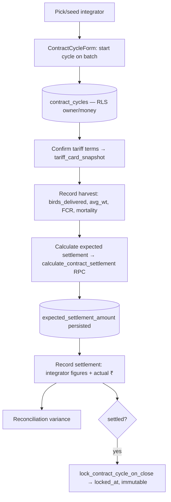

# Module 9 — Contract Farming & Settlement · Audit Report

**Audited:** 2026-06-18 · against real code + live Supabase project `jusxngbfdmzhlybohell`.
**Status:** ✅ Complete — module is in good shape (F1 already fixed); 1 frontend guard applied,
2 items proposed/flagged.

---

## Flow map



## Backend touchpoints (verified)
- **`calculate_contract_settlement(p_cycle_id)`** (SECURITY DEFINER): tariff snapshot with
  integrator fallback; `base = rate × live_kg`; FCR/mortality bonuses gated on thresholds; returns
  components + total. Math verified correct. Persisted client-side onto the cycle.
- **`lock_contract_cycle_on_close`** (BEFORE UPDATE): stamps `locked_at` on transition to
  `settled` and raises on any update to an already-settled+locked row. Verified.
- **RLS:** `contract_cycles` = owner/money only; `integrators` = read-all (auth), writes only via
  service role / `create_custom_integrator` RPC.

## What's correct (verified)
- **F1 (prior gap) confirmed fixed:** `CycleActions.recalcSettlement()` calls the RPC and persists
  `expected_settlement_amount`; manual field retained as override. Web/mobile parity restored.
- Settled cycles are immutable (lock trigger) and the UI hides actions once `settled`.
- Per-cycle `tariff_card_snapshot` insulates settlement from later integrator card edits.

## Issues found

| ID | Sev | Area | Finding |
|----|-----|------|---------|
| C1 | P2 | Frontend | `CycleActions` allowed **future** harvest / settlement-received dates. |
| **C2** | P2 | Security | `calculate_contract_settlement` authorizes on **farm membership only** (any role). A worker/vet — who is blocked by RLS from reading `contract_cycles` directly — can still call the RPC and read settlement ₹ for a cycle on their farm. Money-info leak vs the owner/money RLS model. |
| C3 | P2 | Freemium | Contract farming is a **paid-only** feature per spec, but `contract_cycles` RLS gates on owner/money, **not `is_paid`** — a non-paid owner could create cycles via direct API (UI gate only). → verify paid-feature DB gating in M18. |
| C4 | P2 | Accuracy | `calculate_contract_settlement` uses the **typed** harvest FCR/mortality, not daily-log-derived KPIs — typed figures that disagree with batch KPIs drive the settlement (carried from prior doc). |

## Fixes applied this pass (frontend, in-scope)

### C1 — Block future harvest / settlement dates ✅
`contract/[id]/CycleActions.tsx`: `actual_harvest_date` and `settlement_received_date` now
`.refine(v => v <= today)` + `max` on inputs.
**Verification:** `tsc --noEmit` → exit 0, 0 errors.

## Proposed (NOT applied — DB, awaiting approval)

### C2 — Tighten settlement RPC authz to owner/money
```sql
-- inside calculate_contract_settlement, replace the membership check with:
IF NOT (public.is_farm_owner(v_cycle.farm_id) OR public.is_tenant_money(v_cycle.tenant_id)) THEN
  RAISE EXCEPTION 'not authorised for this contract cycle' USING ERRCODE = 'insufficient_privilege';
END IF;
```
Aligns the RPC with the owner/money RLS on `contract_cycles`.

### C3 — paid-feature DB gating (cross-module → M18)
Confirm whether `contract_cycles` (and traceability, multi-farm) should carry an `is_paid(...)`
check at the DB layer, or whether the writable-gate + UI gate is deemed sufficient. Decide in Billing.

## Enterprise SaaS gap notes (Phase 5)
- ✅ Strong: tariff-snapshot isolation; immutable settled cycles; correct bonus math; reconciliation
  with integrator figures; WhatsApp statement share.
- ➖ Thin: RPC authz scope (C2); paid-feature DB gating (C3); settlement not KPI-derived (C4).

## Completion gate
✅ Flow mapped · ✅ Settlement RPC + lock trigger + RLS read from live DB · ✅ Frontend (cycle
actions, F1 recalc) audited + C1 fixed, typecheck-clean · ✅ Documented; C2 authz tightening
proposed (not applied), C3 deferred to M18.
