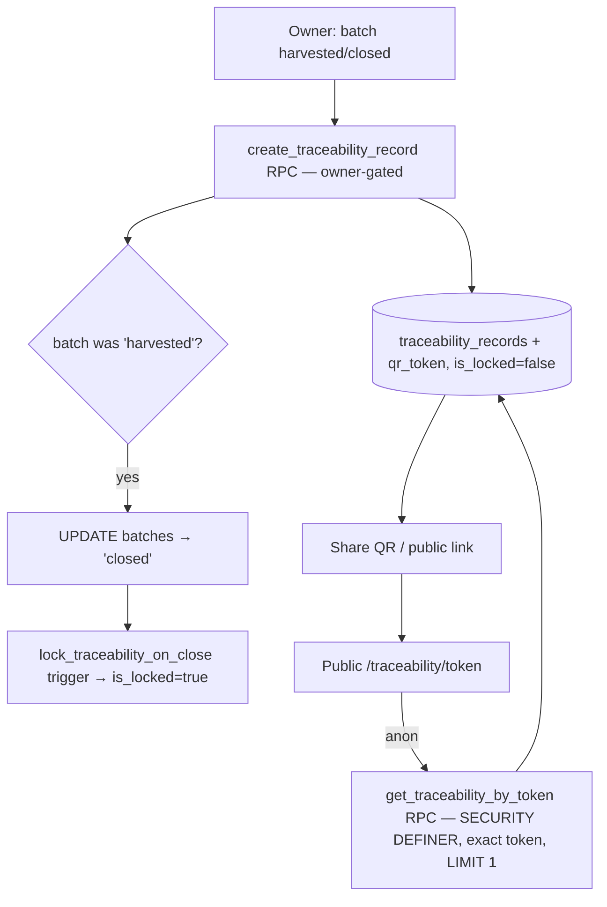

# Module 10 — Traceability · Audit Report

**Audited:** 2026-06-18 · against real code + live Supabase project `jusxngbfdmzhlybohell`.
**Status:** ✅ Complete — 1 P1 cross-app-parity gap fixed (web could not issue certificates),
1 design-token violation fixed; two historical P0/cross-module concerns verified **resolved**;
2 items proposed/deferred.

---

## Flow map



## Backend touchpoints (verified from live DB)
- **`create_traceability_record(p_batch_id)`** (SECURITY DEFINER): owner-only (checks
  `farm_users.role='owner'`); requires batch `harvested|closed`; rolls up done-vaccination count,
  health-incident count, withdrawal clearance; `ON CONFLICT (batch_id) DO UPDATE … WHERE NOT is_locked`
  (locked records are immutable); **flips a `harvested` batch → `closed`**, which fires the lock.
- **`get_traceability_by_token(p_token)`** (SECURITY DEFINER, STABLE): exact `qr_token` match,
  `length>0`, `LIMIT 1` — the sole anon path. **No anon table policy exists.**
- **`lock_traceability_on_close()`** (trigger on `batches`): on transition to `closed`, sets
  `is_locked=true` for the batch's record.
- **RLS on `traceability_records`:** SELECT/INSERT/UPDATE/DELETE all `{authenticated}`, gated on
  tenant-member + (tenant-admin OR farm owner/member). **No `{anon}` policy** — anon reads go only
  through the token RPC.

## What's correct / verified resolved
- **Historical P0 "anon traceability RLS leak" — RESOLVED.** There is no anon SELECT policy on the
  table; public access is exclusively via `get_traceability_by_token` (exact token, `LIMIT 1`, no
  range/enumeration). The public page (`/traceability/[token]/page.tsx`) calls only that RPC.
- **Cross-module M2 "lock never fires (web never reaches closed)" — RESOLVED.** Certificate
  generation itself drives `harvested → closed`, firing `lock_traceability_on_close`. The record is
  re-fetched post-close, so the returned record is already locked. The lifecycle does reach `closed`.

## Issues found

| ID | Sev | Area | Finding |
|----|-----|------|---------|
| **T1** | **P1** | Cross-app parity | **Web could not issue a certificate at all.** `create_traceability_record` was called only from `mobile-app/app/batches/[id].tsx`. The web had list + share + public page but **no create path**; the batch-detail actions render only while `status='active'`, so harvested/closed web batches had no traceability action. The list empty-state ("generated when a batch is closed") was misleading — nothing auto-generates on close. A web-only owner could never produce a buyer certificate. |
| **T2** | P2 | Design | Public certificate PDF (`DownloadCertificate.tsx`) hardcoded the **retired Kraken purple** `#7132f5` (rgb 113,50,245) in the header text + table-head fill — a buyer-facing artifact off-brand vs the ElevenLabs ink palette. |
| T3 | P2 | Correctness (edge) | If a batch reaches `closed` **without** a record and a cert is generated afterward, the new record is inserted `is_locked=false` and never locks (the lock trigger already fired on the earlier transition). Normal flow (harvested → cert → closed) is unaffected. |
| T4 | P2 | Dead code (G1) | `certificate_pdf_url` is never populated — no `generate-traceability-pdf` Edge Function exists. The public page's conditional "Download full certificate (PDF)" link gated on it therefore never renders; the client-side jsPDF `DownloadCertificate` already fully covers the "PDF + WhatsApp share" promise. |
| T5 | P2 | Freemium (→ M18) | Traceability is **paid-only** per spec, but `create_traceability_record` checks owner, **not `is_paid`** — a free-plan owner could create via direct RPC (UI-gate only). Same pattern as M9-C3; decide DB paid-gating in Billing. |

## Fixes applied this pass (frontend, in-scope)

### T1 — Web certificate generation (parity) ✅
- New `batches/[id]/GenerateCertificate.tsx` (client): calls the same owner-gated
  `create_traceability_record` RPC, then `router.refresh()`. Shows a **Generate certificate** CTA
  when no record exists, or a **View & share certificate** link (with locked/in-progress copy) when
  one does.
- `batches/[id]/page.tsx`: server-fetches the existing `qr_token`/`is_locked` for
  harvested/closed batches and renders the section. Web now matches mobile.

### T2 — PDF brand color ✅
`DownloadCertificate.tsx`: header text + table-head fill `rgb(113,50,245)` → `rgb(41,37,36)`
(`colors.primary` ink `#292524`). (Pre-existing `(16,17,20)` ink / `(2,107,63)` success-green left
as-is; both are within token tolerance.)

**Verification:** `tsc --noEmit -p tsconfig.json` → exit 0.

## Proposed (NOT applied — DB, awaiting approval)

### T3 — Lock cert when the batch is already closed at issue time
```sql
-- in create_traceability_record INSERT, set is_locked from batch status instead of literal false:
--   …, harvest_date, buyer_name, is_locked
-- ) VALUES ( …, v_batch.harvest_date, NULL, (v_batch.status = 'closed') )
```
Closed-batch certificates become immutable on creation, matching the lock semantics.

### T4 — Drop the dead PDF column/link (cleanup) or build the Edge Function
Recommendation: **keep client-side jsPDF** (covers the requirement at zero server cost) and drop the
unused `certificate_pdf_url` column + the conditional link in `/traceability/[token]/page.tsx`.
Don't build a redundant `generate-traceability-pdf` Edge Function. (Cosmetic — link silently never
shows today.) → cross-listed for the cleanup pass.

### T5 — paid-feature DB gating → decide in M18 (with M9-C3).

## Completion gate
✅ Flow mapped · ✅ RPCs + lock trigger + RLS read from live DB · ✅ Anon enumeration & M2 lock
concerns verified resolved · ✅ Web parity (T1) + brand (T2) fixed, typecheck-clean · ✅ Documented;
T3 lock-on-closed proposed, T4 cleanup flagged, T5 deferred to M18.
