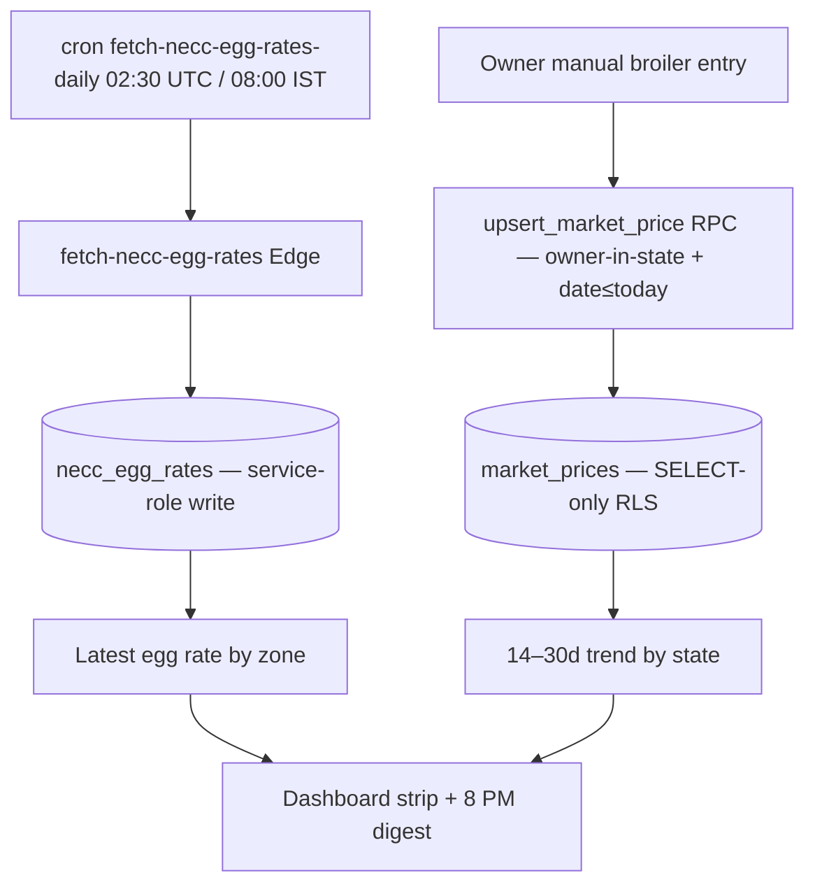

# Module 11 — Market Prices · Audit Report

**Audited:** 2026-06-18 · against real code + live Supabase project `jusxngbfdmzhlybohell`.
**Status:** ✅ Complete — 1 P1 (broken web write path) fixed; NECC auto-fetch + RPC guards verified;
1 product-decision gap (no broiler auto-fetch) and 1 P2 carried.

---

## Flow map

## Backend touchpoints (verified from live DB)
- **`upsert_market_price(state, date, broiler, egg)`** (SECURITY DEFINER): validates state present,
  `price_date ≤ CURRENT_DATE`, non-negative prices, at least one price set, and **caller is an
  `owner` of a farm in that state**; upserts on `(state, price_date)` with `source='manual'`. Solid.
- **Cron `fetch-necc-egg-rates-daily`** (jobid 9, `30 2 * * *` UTC = **08:00 IST**, **active**) →
  `fetch-necc-egg-rates` Edge → `necc_egg_rates`.
- **RLS:** `market_prices` = `SELECT` `true` for `{authenticated}`, **no INSERT/UPDATE/DELETE policy**
  (writes only via the SECURITY-DEFINER RPC or service role). `necc_egg_rates` = same SELECT-all,
  service-role writes. Both RLS-enabled. Sound read-public / write-gated model.

## Issues found

| ID | Sev | Area | Finding |
|----|-----|------|---------|
| **M1** | **P1** | Broken write / parity | **Web manual price entry was non-functional.** `PriceEntryForm` wrote via `supabase.from('market_prices').upsert(...)`, but `market_prices` has **SELECT-only RLS** (no INSERT policy) — every manual save was silently rejected by RLS. Mobile (`mobile-app/app/market-prices/index.tsx:152`) correctly used the `upsert_market_price` RPC. The web path also had **no future-date guard**. |
| G3 | P1 (product) | Coverage | **No automated broiler price fetch.** `fetch-market-prices` (the v1 broiler cron in CLAUDE.md) does **not exist**; only NECC **egg** rates auto-fetch. Broiler prices are manual-only. This is a standing product decision (Agmarknet scraping is flagged fragile in CLAUDE.md risks) — keep manual entry or build a feed later. UI copy already corrected to not promise a non-existent cron. |
| M2 | P2 | UX | Web manual-entry `state` is free text. The RPC safely rejects a state the caller doesn't own, but a prefilled/constrained picker of the owner's farm states would prevent confusing "only owners in X…" errors. |

## Fixes applied this pass (frontend, in-scope)

### M1 — Route web manual entry through the RPC (+ future-date guard) ✅
`market-prices/new/PriceEntryForm.tsx`:
- `onSubmit` now calls `supabase.rpc('upsert_market_price', { p_state, p_price_date,
  p_broiler_price_per_kg, p_egg_price_per_100 })` instead of the RLS-blocked direct upsert. The web
  write path now works and inherits the RPC's owner-in-state + non-negative + date≤today guards.
- Added a client-side `price_date ≤ today` zod refine + `max` on the date input (UX parity with the
  server guard and with M3/M6/M7/M9 date hardening).

**Verification:** `tsc --noEmit -p tsconfig.json` → exit 0.

## What's correct / verified
- NECC egg-rate auto-fetch is genuinely scheduled and active (jobid 9) — egg rates refresh daily.
- `market_prices` / `necc_egg_rates` follow the app's read-public / write-via-RPC-or-service-role
  pattern; no client can forge prices.
- `upsert_market_price` rejects future dates, negatives, empty rows, and non-owners.

## Proposed (NOT applied)
None this module — the P1 was a frontend write-path bug; no DB/Edge change required. G3 (broiler
auto-fetch) is a product decision, not a defect to silently patch.

## Completion gate
✅ Flow mapped · ✅ RPC + cron + RLS read from live DB · ✅ Broken web write path (M1) fixed,
typecheck-clean · ✅ NECC auto-fetch verified active · ✅ Documented; G3 product decision + M2 UX
carried, no backend change proposed.
