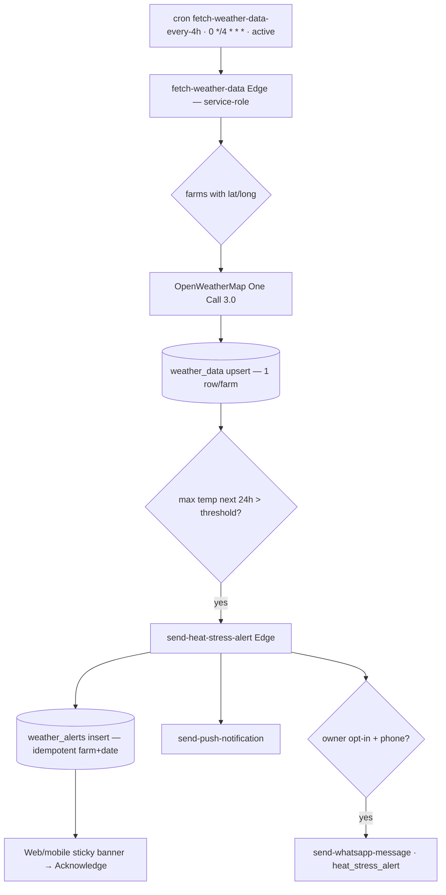

# Module 12 — Weather & Heat-Stress Alerts · Audit Report

**Audited:** 2026-06-18 · against real code + live Supabase project `jusxngbfdmzhlybohell`.
**Status:** ✅ Complete — backend pipeline verified end-to-end (cron + both Edge functions + RLS);
1 P1 UX/backfill gap fixed (no easy way to set existing-farm coordinates); 2 P2 carried/proposed.

---

## Flow map

## Backend touchpoints (verified from live DB + source)
- **Cron `fetch-weather-data-every-4h`** (jobid 1, `0 */4 * * *`, **active**) — 6×/day, within OWM
  free-tier quota up to ~160 farms (the function logs a warning past that).
- **`fetch-weather-data`** Edge: service-role-only auth; **filters `latitude/longitude NOT NULL`**;
  OWM One Call 3.0; upserts one row per farm; computes `max_temp_today` over current+next-24h;
  delegates threshold breaches to `send-heat-stress-alert`. Solid.
- **`send-heat-stress-alert`** Edge: **idempotent** on `(farm_id, 'heat_stress', alert_date)`;
  inserts `weather_alerts`; flags `weather_data.heat_stress_alert_triggered`; **push +
  (opt-in-gated) WhatsApp**, per-channel warn-and-continue. **Phase-2 "all alerts route via push +
  WhatsApp" gate is MET here** (contrast M5 vaccinations, which lacked the WhatsApp channel).
- **RLS:** `weather_data` member SELECT; `weather_alerts` member SELECT + member UPDATE (ack). Inserts
  are service-role (bypass RLS). Reads correctly scoped to tenant+farm members.

## Issues found

| ID | Sev | Area | Finding |
|----|-----|------|---------|
| **W1** | **P1** | UX / data (cross-module M1) | Farms with **NULL coordinates get no weather and no heat-stress alerts** (the Edge filters them out). Existing farm **`MAMA` has NULL lat/long** (created before the onboarding location step). The web **edit** form exposed raw `latitude`/`longitude` number fields but **no geolocation capture** — a farmer can't supply coordinates they don't know, so such farms were effectively stranded with no weather. |
| W2 | P2 | RLS (loose write) | `weather_alerts_member_ack` is an UPDATE policy gated only on farm membership for **all columns** — any member (incl. worker) can rewrite `severity`/`mitigation_actions_json`/`max_temp_forecast` on server-generated audit rows, not just `acknowledged_at`. |
| W3 | P2 | Accuracy | Heat threshold is a single per-farm value; no per-breed calibration (CLAUDE.md false-positive risk). |

## Fixes applied this pass (frontend, in-scope)

### W1 — "Use my location" on the farm edit form ✅
`farms/[id]/edit/EditFarmForm.tsx`: added a **📍 Use my current location** button that calls
`navigator.geolocation.getCurrentPosition` and writes `latitude`/`longitude` (6-dp) via `setValue`,
plus helper text ("Coordinates power weather & heat-stress alerts. Without them this farm gets no
forecast."). Mirrors the onboarding location step (M1) so existing farms can be **backfilled**.
This gives `MAMA` a one-tap fix path (its owner must still click it once).

**Verification:** `tsc --noEmit -p tsconfig.json` → exit 0.

## What's correct / verified
- The full pipeline (cron → OWM → upsert → threshold → alert → push + WhatsApp → banner → ack) is
  implemented and consistent; both Edge functions are service-role-locked and resilient.
- Heat-stress WhatsApp parity is genuinely wired (template `heat_stress_alert`, opt-in gated).
- Weather page degrades gracefully ("No weather data yet. Set lat/long in farm settings.").

## Proposed (NOT applied — DB, awaiting approval)

### W2 — Scope the alert-ack write to `acknowledged_at`
RLS can't restrict columns directly; the clean fix is a small `acknowledge_weather_alert(p_alert_id)`
SECURITY-DEFINER RPC (sets only `acknowledged_at = now()` for a member's farm) + drop the broad
member UPDATE policy. Low risk; mirrors the `update_vet_note` pattern from M4.

### W3 — per-breed threshold calibration → product backlog (not a defect).

## Completion gate
✅ Flow mapped · ✅ cron + both Edge functions + RLS read from live DB · ✅ Backfill path (W1) fixed,
typecheck-clean · ✅ Push+WhatsApp alert parity verified · ✅ Documented; W2 ack-scope RPC proposed,
W3 carried. Cross-module M1 (existing-farm coordinate backfill) now has a UI path.
