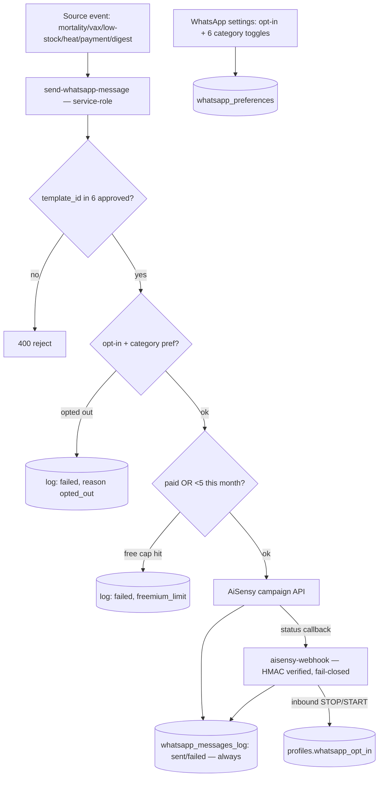

# Module 13 — WhatsApp & Notifications · Audit Report

**Audited:** 2026-06-18 · against real code + live Supabase project `jusxngbfdmzhlybohell`.
**Status:** ✅ Complete — messaging backbone audited end-to-end (both Edge functions + webhook + log
RLS + freemium cap). 1 P1 web parity gap fixed (per-category prefs); the flow doc's "open" freemium
item is verified **already resolved**; 1 P2 noted.

---

## Flow map

## Backend touchpoints (verified from source + live DB)
- **`send-whatsapp-message`** (service-role): Zod body; **rejects non-approved template_ids** (the 6
  Meta IDs); **global opt-in + per-category `whatsapp_preferences` gate** (logs `opted_out_*`);
  **freemium 5/month cap** for non-paid farms (counts non-failed `whatsapp_messages_log` rows since
  month start; `is_paid` grace-period logic inline); AiSensy POST; **always logs** (sent & failed);
  graceful when `AISENSY_API_KEY` unset. Excellent.
- **`aisensy-webhook`** (public, HMAC-SHA256): **fails CLOSED** when `AISENSY_WEBHOOK_SECRET` unset
  (SEC-6; dev escape hatch `ALLOW_UNSIGNED_WEBHOOKS`); **constant-time** signature compare; updates
  log status by `aisensy_message_id`; inbound **STOP→opt-out / START|RESUME→opt-in / REPORT**;
  always 200 on well-formed bodies to avoid retry loops. Strong.
- **`whatsapp_messages_log` RLS:** SELECT `is_tenant_money OR is_farm_owner` only; **no
  INSERT/UPDATE/DELETE policy** (service-role writes; never deleted — audit trail). Sound.
- **`profiles.whatsapp_preferences`** jsonb, default all-6-true; honored by the Edge gate.

## Issues found

| ID | Sev | Area | Finding |
|----|-----|------|---------|
| **W1** | **P1** | Web parity / feature | **Web WhatsApp settings had no per-category control.** `WhatsAppSettingsForm` toggled only the global `whatsapp_opt_in`, yet `send-whatsapp-message` gates each send on `whatsapp_preferences[template_id]` and **mobile has full per-category toggles**. Screen #23 ("Notification preferences per category") + CLAUDE.md's opt-in-fatigue risk both require this. Web users could only kill *all* WhatsApp or none. |
| W2 | P2 | Freemium semantics | The 5/month free cap counts **all** non-failed sends including user-initiated shares (`invoice`/`traceability_cert`/`report`), not just the 6 automated "alerts". Defensible, but a chatty sharer burns the alert budget. Consider excluding share types from the cap count. |

## Verified RESOLVED (flow doc was stale)
- **Freemium 5/month cap IS enforced server-side** (`send-whatsapp-message` L259–297) — the flow doc
  listed this as "still open". It counts non-failed monthly rows and returns `freemium_limit` with an
  audit row. Updated the flow doc.
- Per-category opt-out + STOP handling + `expo_push_token` capture were already confirmed in prior
  passes; re-verified here.

## Fixes applied this pass (frontend, in-scope)

### W1 — Per-category WhatsApp preferences on web ✅
- `whatsapp-settings/page.tsx`: now selects + passes `whatsapp_preferences`.
- `WhatsAppSettingsForm.tsx`: replaced the static "what you'll receive" list with **6 interactive
  category toggles** (mortality / heat / vaccination / payment / low-stock / daily-digest — keys in
  lockstep with the Edge allow-list and the mobile screen), written to `whatsapp_preferences`.
  Toggles disable + dim when global opt-in is off. Web/mobile parity restored; the existing backend
  gate now has a web UI to drive it.

**Verification:** `tsc --noEmit -p tsconfig.json` → exit 0.

## Proposed (NOT applied)
None — backend is sound. W2 is a product-semantics tweak (one-line `.in('message_type', …)` filter
on the cap count) deferred pending a call on whether shares should count.

## Completion gate
✅ Flow mapped · ✅ both Edge functions + webhook signature + log RLS + freemium cap read from source/
live DB · ✅ Web per-category prefs (W1) fixed, typecheck-clean · ✅ Stale freemium-cap gap verified
resolved · ✅ Documented; no backend change required.
