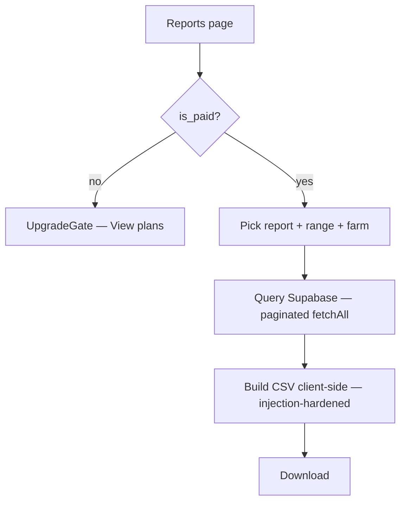

# Module 14 — Reports / Exports · Audit Report

**Audited:** 2026-06-18 · against real code + live Supabase project `jusxngbfdmzhlybohell`.
**Status:** ✅ Complete — 3 P1s fixed (missing paid gate, CSV injection, silent row truncation);
2 P2 doc/UX items carried. CSV is client-side over RLS-protected reads.

---

## Flow map

## Touchpoints (verified)
- **`ReportExports.tsx`** (client): 3 report types (daily_logs, transactions, batches), farm +
  date-range pickers; queries Supabase and builds CSV in-browser. Reads are RLS-scoped
  (farm-member SELECT) — no privilege escalation; a user only ever exports their own farm's data.
- **No `generate-report-pdf` Edge Function** exists — exports are CSV-only (the page already says so).

## Issues found

| ID | Sev | Area | Finding |
|----|-----|------|---------|
| **R1** | **P1** | Freemium | **"Full export" is a paid feature** (CLAUDE.md freemium table) but the Reports page had **no gate** — any free/trial user could export everything. `/multi-farm` and `/contract` already gate via `UpgradeGate`; Reports didn't. |
| **R2** | **P1** | Security (CSV injection) | `toCsv` quoted delimiters but did **not** neutralize **formula injection**: a free-text field (`notes`, `buyer_or_supplier`, `death_cause`) beginning with `=`, `+`, `-`, `@`, tab or CR executes as a formula when the CSV is opened in Excel/Google Sheets — a classic data-exfil / command vector in an export the farmer may forward to an accountant. |
| **R3** | **P1** | Data integrity | Exports issued a **single un-paginated query** → silently truncated at PostgREST's **1000-row** cap. An active farm with >1000 daily logs/transactions got an incomplete "full export" with no warning. |
| R4 | P2 | UX | The `batches` export ignores the date range (all-time, by design) yet the filename still embeds `_<from>_to_<to>` — misleading. |
| G2 | P2 | Docs | No `generate-report-pdf` (CLAUDE.md/TRD "PDF report" unimplemented). Reports are CSV-only; align docs rather than build a redundant function. |

## Fixes applied this pass (frontend, in-scope)

### R1 — Gate Reports behind `UpgradeGate` ✅
`reports/page.tsx`: split into `ReportsPage` (wraps `<UpgradeGate feature="Data export" …>`) +
`ReportsContent`. Uses the same server-side `is_paid()` RPC as multi-farm/contract — free/trial users
see the upgrade card. (DB note: the underlying reads are the user's *own* RLS-scoped rows, so this is
correctly a **feature/UI gate**, not a data-security boundary — no DB change warranted.)

### R2 — CSV formula-injection guard ✅
`toCsv` now prefixes any cell beginning with `= + - @ \t \r` with an apostrophe so spreadsheets treat
it as literal text, before the existing delimiter-quoting.

### R3 — Paginate the full export ✅
Added `fetchAll(page)` that loops `.range(offset, offset+999)` until a short page, accumulating all
rows. All three report queries now fetch the complete set regardless of size.

**Verification:** `tsc --noEmit -p tsconfig.json` → exit 0.

## Proposed (NOT applied)
None — all three P1s were frontend. R4/G2 are cosmetic/doc.

## Completion gate
✅ Flow mapped · ✅ export path + RLS reads reviewed · ✅ Paid gate (R1), CSV injection (R2), row
truncation (R3) fixed, typecheck-clean · ✅ Documented; R4/G2 carried, CSV-only confirmed (no Edge
function to build).
