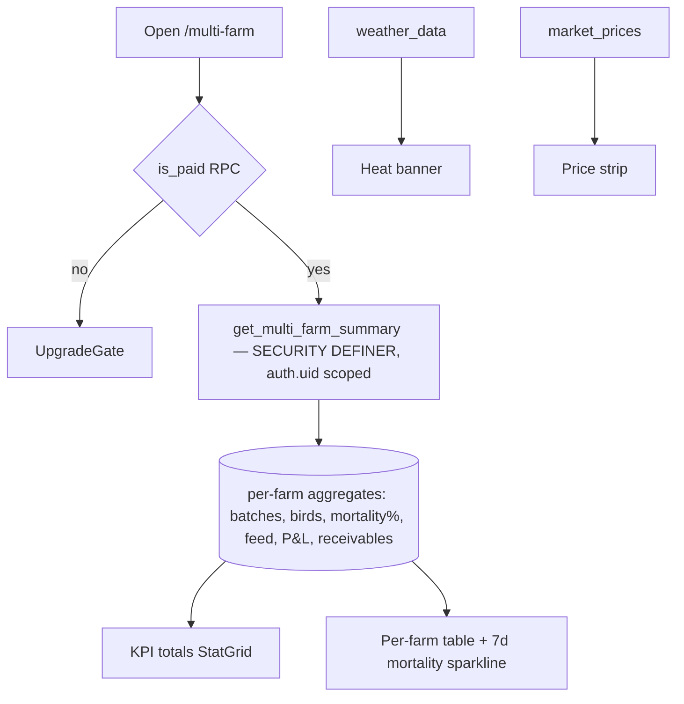

# Module 15 — Multi-Farm Dashboard · Audit Report

**Audited:** 2026-06-18 · against real code + live Supabase project `jusxngbfdmzhlybohell`.
**Status:** ✅ Complete — RPC scoping + paid gate verified sound; **1 P1 data-consistency bug**
(receivables overstated vs the canonical buyer-balance math) proposed as a DB fix; 1 P2 carried.

---

## Flow map



## Backend touchpoints (verified from live DB)
- **`get_multi_farm_summary()`** (SECURITY DEFINER): `auth.uid()` gate (empty on null);
  `accessible_farms` = `owner_id = uid` **OR** an **accepted** `farm_users` membership — every
  aggregate CTE is filtered to those farm ids, so **no cross-tenant leakage**. Month boundary uses
  `date_trunc('month', now() AT TIME ZONE 'Asia/Kolkata')` (correct IST). One round trip. Good.
- **`is_paid(uid DEFAULT auth.uid())`** → `is_tenant_paid(tenant)`; `UpgradeGate` calls it argless.
  Gate verified consistent with /contract, /multi-farm, /reports.

## Issues found

| ID | Sev | Area | Finding |
|----|-----|------|---------|
| **D1** | **P1** | Data consistency | **Receivables are overstated.** `receivables_agg` does `SUM(amount) WHERE payment_status IN ('pending','partial')` — counting the **full** amount of a *partial* transaction, ignoring `amount_paid`. The canonical `update_buyer_balance` trigger nets it: `partial → GREATEST(amount − COALESCE(amount_paid, amount*0.5), 0)`. So the consolidated "Receivables" tile (and per-farm column) **disagrees with the Khata ledger**, double-counting the already-paid slice of partials. |
| D2 | P2 | Metric semantics | `mortality_pct_month` = (this-month deaths) ÷ (all-time opening of active batches). Mixing a monthly numerator with an all-time denominator understates % for long-running batches. Defensible as a dashboard heuristic but inconsistent with the batch-level livability metric. |

## What's correct / verified
- Tenant/role scoping is airtight (owner or accepted member only; all CTEs farm-id-filtered).
- IST month boundary, single-round-trip aggregation, `UpgradeGate` paid gate, graceful empty state.
- The page itself (read in M14) needs **no change** — the bug is entirely in the RPC's receivables CTE.

## Proposed (NOT applied — DB, awaiting approval)

### D1 — Net `amount_paid` in the receivables aggregate (align to buyer-balance)
```sql
-- replace receivables_agg inside get_multi_farm_summary():
receivables_agg AS (
  SELECT ft.farm_id,
         COALESCE(SUM(
           CASE
             WHEN ft.payment_status = 'partial'
               THEN GREATEST(ft.amount - COALESCE(ft.amount_paid, ROUND(ft.amount * 0.5, 2)), 0)
             ELSE GREATEST(ft.amount - COALESCE(ft.amount_paid, 0), 0)   -- 'pending'
           END
         ), 0)::NUMERIC AS pending_receivables
    FROM public.financial_transactions ft
   WHERE ft.farm_id IN (SELECT id FROM accessible_farms)
     AND ft.transaction_type = 'income'
     AND ft.payment_status IN ('pending', 'partial')
   GROUP BY ft.farm_id
)
```
Mirrors `update_buyer_balance` exactly, so the dashboard total reconciles with the Khata sum. Pure
read-path math change; low risk.

### D2 — define a single canonical "month mortality %"  → product/metrics decision (not a defect to silently patch).

## Completion gate
✅ Flow mapped · ✅ RPC scoping + IST + paid gate read from live DB · ✅ No frontend change needed
(page correct) · ✅ Documented; **D1 receivables-netting proposed (top of this module's backlog)**,
D2 carried.
