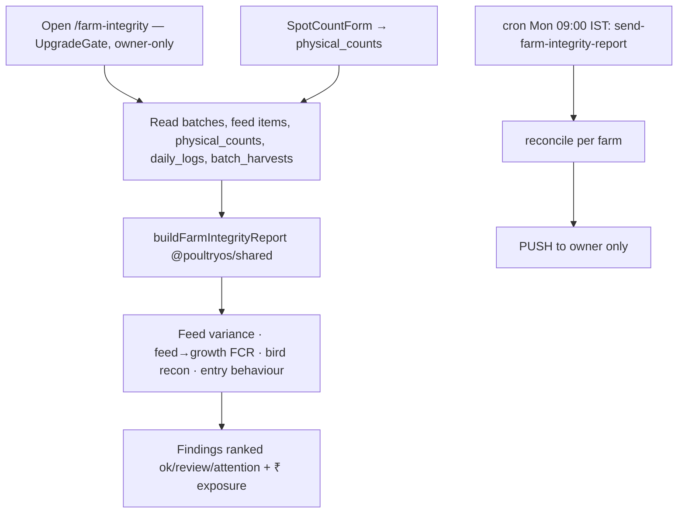

# Module 16 — Farm Integrity (Owner Trust) · Audit Report

**Audited:** 2026-06-18 · against real code + live Supabase project `jusxngbfdmzhlybohell`.
**Status:** ✅ Complete — **1 P1 false-positive bug fixed in both apps** (wrong harvest column →
false "missing birds" alerts); Edge delivery model clarified (push-only by design); flow doc
corrected. No backend change needed.

---

## Flow map

## Touchpoints (verified)
- **Web page** (`farm-integrity/page.tsx`, `UpgradeGate`-wrapped): reconciles via the shared engine
  over a 14-day window; `physical_counts` is **owner-only RLS** (`is_farm_owner`). Good.
- **`@poultryos/shared` `reconcileBirdCount`**: `expectedCount = opening − deaths − sold`;
  flags `|ledgerDrift| > 5` as **review even with no physical count** (L172).
- **`send-farm-integrity-report`** Edge (cron Mon 09:00 IST): service-role; **PUSH-only to the owner**
  — the comment is explicit that a WhatsApp send awaits the Meta-approved `farm_integrity` template
  ("we never invent template IDs"). Degrades gracefully; no failed WhatsApp attempts.

## Issues found

| ID | Sev | Area | Finding |
|----|-----|------|---------|
| **I1** | **P1** | False positives (data) | **Wrong column in bird reconciliation.** Both web (`page.tsx`) and mobile (`farm-integrity/index.tsx`) queried `batch_harvests.select('batch_id, birds')` + read `h.birds`, but the column is **`birds_harvested`**. The query errors → `soldByBatch` is empty → `expectedCount = opening − deaths − 0`, so `ledgerDrift = −sold_actual`. Since `reconcileBirdCount` flags `|ledgerDrift| > 5` **even with no physical count**, **every active batch that recorded a partial harvest of >5 birds produced a false "bird variance / review" finding** ("…differs from the system by −N, counted 0"). This directly erodes the Owner-Trust signal — the exact failure mode flagged in CLAUDE.md risks. |
| I2 | P2 | Maintainability | `send-farm-integrity-report` **duplicates** the reconciliation thresholds from `packages/shared/src/farm-integrity.ts` (Deno can't import the TS). Currently in sync (window 14, feed >10kg, birds >5, FCR >1.15×, backfill >2d) but at risk of drift; acknowledged in a code comment. |

## Fixes applied this pass (frontend, in-scope)

### I1 — Correct the harvest column in both apps ✅
- `frontend/app/(dashboard)/farm-integrity/page.tsx`: `select('batch_id, birds_harvested')` +
  `Number(h.birds_harvested ?? 0)`.
- `mobile-app/app/farm-integrity/index.tsx`: same two changes.
Now `soldOrTransferred` reflects reality, `ledgerDrift ≈ 0`, and partially-harvested batches no longer
trip a false finding.

**Verification:** web `tsc --noEmit -p tsconfig.json` → exit 0. (Mobile change is the identical
one-token column rename.)

## Doc correction (no defect)
The flow doc claimed the Edge does "WhatsApp share" and listed a P1 that it "may fail to deliver"
until the template is approved. In reality the function is **push-only by design** and never attempts
WhatsApp, so there is **no failed-delivery path**; the web integrity page has no WhatsApp-share action
either. Flow doc updated to reflect push-only + deferred WhatsApp.

## Proposed (NOT applied)
None — I1 was a frontend column bug; the Edge function and RLS are correct. I2 is a maintainability
note (consider generating the Deno thresholds from the shared source, or a shared test asserting parity).

## Completion gate
✅ Flow mapped · ✅ shared engine + Edge + `physical_counts` RLS reviewed · ✅ False-positive column
bug (I1) fixed in web + mobile, web typecheck-clean · ✅ Push-only delivery verified & doc corrected ·
✅ Documented; no backend change required.
