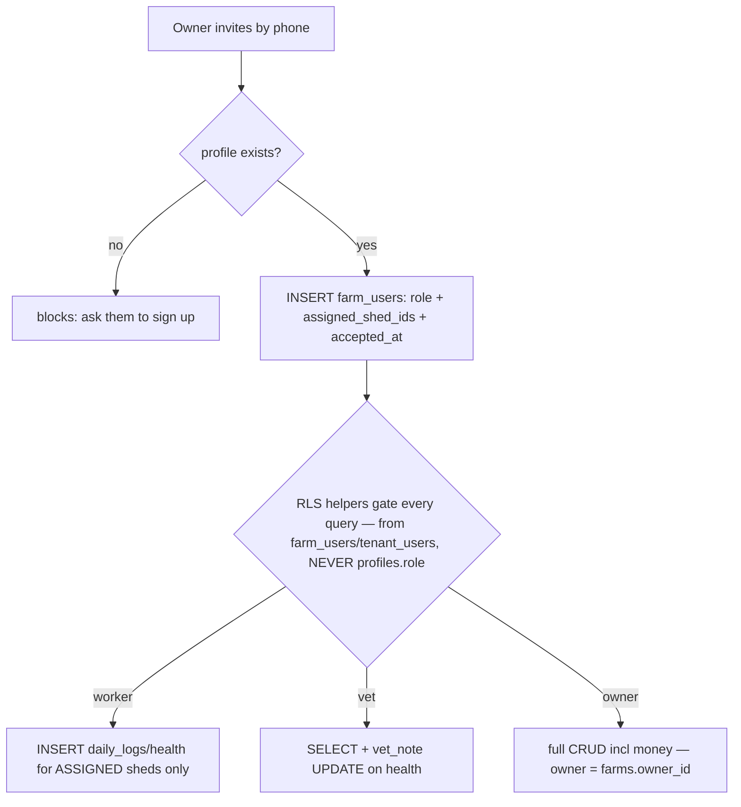

# Module 17 — Team & Roles (RLS) · Audit Report

**Audited:** 2026-06-18 · against real code + live Supabase project `jusxngbfdmzhlybohell`.
**Status:** ✅ Complete — **the M1 `profiles.role` trust concern is verified harmless**; **1 P1 fixed**
(web-invited workers couldn't log anything) + accepted_at now set; freemium caps deferred to the
consolidated cap-trigger work.

---

## Flow map

## Security verification (the M1 cross-module question)
- **No RLS policy references `profiles.role`** (queried every `pg_policy` qual/withcheck — empty).
  Authorization derives entirely from `farm_users` (`is_farm_owner`, `is_farm_member`,
  `user_role_for_farm`, `user_assigned_sheds`) and `tenant_users` (`is_tenant_admin/member/money`).
  → `handle_new_user` defaulting `profiles.role='owner'` for everyone is **harmless**. **M1→M17
  cross-item RESOLVED.**
- `is_farm_owner` = `farms.owner_id = auth.uid()` (not `farm_users.role`), so a `farm_users` row with
  `role='owner'` grants **only membership**, not money/admin — no privilege escalation via the role
  column. `farm_users` INSERT is gated to `is_tenant_admin OR is_farm_owner` (CHECK). Sound.

## Issues found

| ID | Sev | Area | Finding |
|----|-----|------|---------|
| **T1** | **P1** | Broken role / function | **Web-invited workers could not log anything.** `InviteForm` never set `assigned_shed_ids`, and there was **no edit-member UI**. `user_assigned_sheds` returns `'{}'` when NULL, and the `daily_logs` worker INSERT policy requires `b.shed_id = ANY(user_assigned_sheds(...))` — so an invited worker's INSERTs were **all rejected by RLS**. Their entire purpose (daily logging) was blocked. |
| **T2** | P2 | UX / data | `InviteForm` set only `invited_at`, never `accepted_at`. Members showed **"Pending" forever** (access is actually immediate), and `get_multi_farm_summary` (filters `accepted_at IS NOT NULL`) **excluded a member's own farms** from their multi-farm aggregate. |
| T3 | P2 | Freemium | The team page has **no gate**: free-plan caps (**2 workers**, **vet = paid**) are enforced **nowhere** — not UI, not DB. A free owner can invite vets + unlimited workers via the web. |

## Fixes applied this pass (frontend, in-scope)

### T1 — Assign sheds at invite time (workers) ✅
- `team/page.tsx`: also fetches active `sheds` and passes them to `InviteForm`.
- `team/InviteForm.tsx`: when role = **worker**, renders a required shed multi-select (filtered to the
  chosen farm) and writes `assigned_shed_ids`; **blocks submit with no shed selected** ("a worker can
  only log for sheds assigned to them"). Vets keep `assigned_shed_ids = null` (whole-farm read).

### T2 — Mark invited members Active ✅
The insert now sets `accepted_at = now()` (access is immediate anyway), so the status label is truthful
and the member's farms appear in their own multi-farm dashboard.

**Verification:** `tsc --noEmit -p tsconfig.json` → exit 0.

## What's correct / verified
- DB is the access boundary: worker/vet/owner scopes enforced by RLS helpers, identical across apps.
- `farm_users` INSERT/UPDATE/DELETE gated to owner/tenant-admin; SELECT scoped to self/owner/admin.

## Proposed / deferred
- **T3 → consolidated cap-trigger backlog (M2/M18):** extend the freemium DB caps to `farm_users`
  (free ≤ 2 workers; `vet` role requires `is_paid`). UI gate optional but the **DB** gate is the
  enforcement of record per CLAUDE.md's "enforce at both levels". No isolated apply this module.

## Completion gate
✅ Flow mapped · ✅ all role helpers + `farm_users`/`daily_logs` policies read from live DB · ✅
`profiles.role` trust concern proven harmless (M1 resolved) · ✅ Worker shed-assignment (T1) +
accepted_at (T2) fixed, typecheck-clean · ✅ Documented; T3 freemium caps folded into the cap-trigger
backlog.
