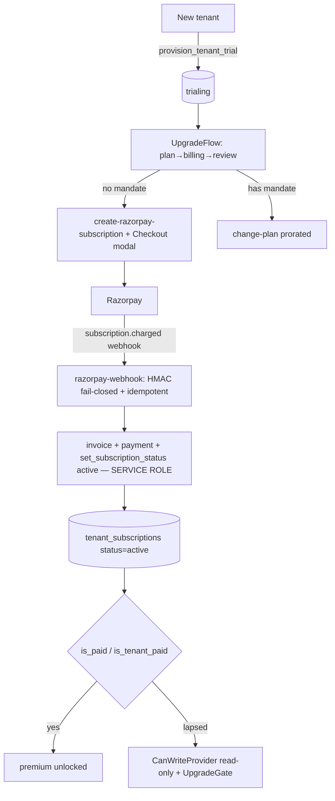

# Module 18 — Billing & Subscription (Razorpay) · Audit Report

**Audited:** 2026-06-18 · against real code + live Supabase project `jusxngbfdmzhlybohell`.
**Status:** ✅ Complete — **core money path verified secure** (owner write-lockdown, fail-closed
webhook, service-role-only activation). No frontend defect. Two consolidated gaps proposed: the
platform-wide **freemium DB caps** (the standing P1) and an `anon`-grant hardening (latent).

---

## Flow map

## Security verification (the sensitive checks)

### ✅ Owner write-lockdown — VERIFIED in place (memory-flagged self-grant vuln is closed)
- `tenant_subscriptions` has table-level UPDATE = **false** for `authenticated`; the only column
  grants are **`plan_id` + `billing_cycle`**. The `tenant_subscriptions_owner_update` RLS policy lets
  an owner touch their row, but the **column GRANT** prevents writing `status`, `current_period_end`,
  `trial_ends_at`, etc. → **an owner cannot self-grant `status='active'`** or extend their period.
  Activation is reachable **only** through `set_subscription_status` (service-role, from the webhook).

### ✅ `razorpay-webhook` — VERIFIED strong
- HMAC-SHA256 of the raw body, **fail-CLOSED** when `RAZORPAY_WEBHOOK_SECRET` unset (SEC-6),
  constant-time compare; **idempotent** via `razorpay_webhook_events` (per `x-razorpay-event-id`);
  the charge path issues invoice + payment + flips status via the service-role RPC and rolls the
  period. A forged charge can't activate a tenant (no secret ⇒ 401). Handles the full lifecycle map.

### ✅ `UpgradeFlow` — no client-side trust
- The client only *initiates* (create-razorpay-subscription / change-plan Edge + Checkout modal);
  **status is never flipped client-side**. Graceful "not configured" fallback. Sound.

## Issues found

| ID | Sev | Area | Finding |
|----|-----|------|---------|
| **B1** | **P1** | Freemium (DB enforcement) | **Quantity + role caps are UI-only.** WhatsApp 5/mo **is** enforced server-side (M13) and premium *pages* are `is_paid`-gated, but the **farm/shed/worker/buyer caps** and **`vet`=paid / premium-creation RPCs** (`create_traceability_record`, contract cycle insert check owner, not `is_paid`) have **no DB/Edge gate** — direct-API bypass. CLAUDE.md mandates enforcement at *both* levels. This consolidates M2, M9-C3, M10-T5, M17-T3. |
| B2 | P2 | Hardening (latent) | `anon` holds `GRANT ALL` (INSERT/UPDATE/DELETE) on **all 66 public tables** (Supabase default). **Not currently exploitable** — every public table has RLS enabled and no sensitive table has an anon-satisfiable policy (all require `auth.uid()`/membership). Still a least-privilege violation on billing/platform tables (defense-in-depth). |

## What's correct / verified
- Owner cannot escalate billing; webhook is the sole activation authority; idempotent + signed.
- `is_paid()` / `is_tenant_paid()` consistently gate premium pages (multi-farm, reports, contract,
  traceability, farm-integrity) — verified across M9–M17.
- Read-only mode (`CanWriteProvider`) on lapse; invoices via `generate-invoice-pdf`.

## Proposed (NOT applied — DB, awaiting approval)

### B1 — Freemium enforcement bundle (the consolidated cap-trigger apply pass)
Apply the cap triggers from **audit report 02** + the **M17** extension, as ONE reviewed pass:
- `enforce_farm_cap` (free = 1), `enforce_shed_cap` (free = 3), `enforce_batch_placement_capacity`.
- `enforce_buyer_cap` (free = 10).
- `farm_users`: free ≤ 2 `worker` rows; `vet` role requires `is_paid(tenant owner)`.
- **Decision needed:** add `is_paid` checks inside premium-creation RPCs `create_traceability_record`
  and the contract-cycle insert (today owner-gated only) — or accept the page-gate as sufficient.
All read `is_tenant_paid`/plan limits; low risk, mirror the existing helper patterns.

### B2 — `anon` grant hardening (optional, defense-in-depth)
`REVOKE INSERT, UPDATE, DELETE ON <billing/platform tables> FROM anon;` (e.g. `tenant_subscriptions`,
`invoices`, `payments`, `tenants`, `platform_admins`, `platform_role_permissions`). Inert today
(RLS covers it) but removes a latent footgun. Verify no anon flow depends on table-level grants
(the public traceability path uses a SECURITY-DEFINER RPC, so it does not).

## Completion gate
✅ Flow mapped · ✅ owner column-lockdown + webhook signature/idempotency + RLS + grants read from live
DB · ✅ No client-side activation path · ✅ No frontend defect · ✅ Documented; **B1 freemium bundle
proposed (consolidates the cap backlog)**, B2 anon hardening proposed. Cross-module paid-gating
(M9-C3, M10-T5, M17-T3) folded into B1.
