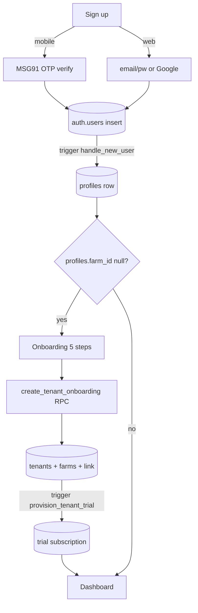

# Auth & Onboarding

## Purpose
Get a user from first launch to a working farm. Two auth paths exist: **mobile OTP**
(primary, MSG91) and **email/password + Google** (web fallback). After auth, a 5-step
onboarding creates the tenant + farm and starts a trial subscription.

## Entry points
- Mobile: `mobile-app/app/(auth)/login.tsx`, `register.tsx`, `verify-otp.tsx`;
  onboarding `mobile-app/app/(onboarding)/step-1-profile.tsx` … `step-5-whatsapp-upi.tsx`,
  `creating.tsx`.
- Web: `frontend/app/(auth)/login/page.tsx`, `forgot-password`, `reset-password`,
  `verify-email`; OAuth/confirm callback `frontend/app/auth/callback/route.ts`;
  wizard `frontend/app/onboarding/OnboardingWizard.tsx`.
- Backend: `msg91-send-sms` (OTP), trigger `handle_new_user` (auto-creates `profiles` row
  on `auth.users` insert), RPC `create_tenant_onboarding(payload)`, trigger
  `provision_tenant_trial` (on `tenants` insert).

## Step-by-step
1. User signs up (mobile: phone → MSG91 OTP → verify; web: email/password or Google).
2. `auth.users` row is created → `handle_new_user` trigger inserts a matching `profiles` row.
3. Layout guard: `frontend/app/(dashboard)/layout.tsx` redirects to `/onboarding` while
   `profiles.farm_id` is null.
4. Onboarding collects: profile name → farm (name/state/type) → integrator (if contract) →
   location (lat/long, NECC zone) → WhatsApp opt-in + UPI id.
5. Final step calls `create_tenant_onboarding()` → creates `tenants` + `farms`, links
   `profiles.farm_id`/`tenant_id`; `provision_tenant_trial` starts the trial.
6. User lands on the dashboard.

## Flow map

## Data & backend
- Tables: `auth.users`, `profiles`, `tenants`, `farms`, `tenant_subscriptions`,
  `onboarding_progress`.
- Functions: `handle_new_user`, `create_tenant_onboarding`, `provision_tenant_trial`,
  `fill_tenant_id_from_farm` (autofills `tenant_id` on inserts).
- Security: auth security tables (`trusted_devices`, `log_auth_event`); Control Center
  operators are a separate `platform_admins` plane (MFA-enforced).

## Cross-app parity
Web uses email/password + Google; mobile uses phone OTP. Both converge on the same
`create_tenant_onboarding` RPC, so the tenant/farm shape is identical.

> **Web vs mobile wizard divergence (verified 2026-06-18):** the two onboarding flows
> are NOT the same shape. **Mobile** = 5 steps `profile → farm → integrator → location →
> whatsapp+upi` (`stores/onboarding` → `completeOnboarding()` → `create_tenant_onboarding`).
> **Web** = `farm → farmType → plan → billing → complete` (`OnboardingWizard.tsx`) — billing
> + the real Razorpay trial mandate now live *inside* onboarding. Both converge on the same
> `create_tenant_onboarding` RPC.

## Gaps
- **P1 — FIXED 2026-06-18** — Web onboarding never captured farm **latitude/longitude**, so
  every web-onboarded farm had NULL coordinates and weather + heat-stress alerts could never
  fire for it (mobile captured them in step-4). Added a "Farm location" section + browser
  geolocation to the web wizard's farm step; lat/long/heat-threshold now flow into the RPC
  (which already accepted them). See `MODULE_AUDIT_REPORT` 01.
- **P1** — Email provider not fully wired for production (per project memory; GoTrue SMTP
  + `send-email` exist but go-live needs DNS/secrets). Affects email verification + reset.
- **P2** — Web auth (`login/page.tsx`, `Topbar` sign-out) does **not** call `log_auth_event`,
  so `auth_audit_events` is populated by mobile only — the security audit trail is incomplete
  on web. Add login-success + sign-out logging (failed-login needs a no-session path).
- **P2** — `auth_leaked_password_protection` is **disabled** (Supabase advisor) — enable
  HaveIBeenPwned breach check in Auth settings. Tenant owners also have **no MFA option**
  (only Control Center operators are MFA-gated).
- **P2** — `handle_new_user` stamps `role='owner'` on **every** new `auth.users` row, including
  users who will be invited as worker/vet. Access is correctly scoped by `farm_users.role`,
  but `profiles.role` is misleading — confirm no policy keys off it (see Team & Roles module).
- **P2** — Confirm OTP rate-limiting / resend cooldown on `verify-otp.tsx`.
