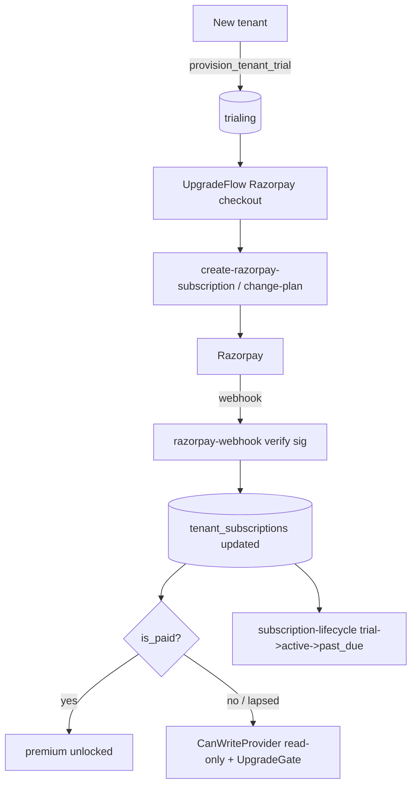

# Billing / Subscription (Razorpay) & Freemium Gates

## Purpose
Monetisation: a tenant starts on a trial, upgrades via Razorpay, and feature access is
gated by `is_paid()` / `tenant_plan_status()`. Read-only mode kicks in when a subscription
lapses.

## Entry points
- Web: `frontend/app/(dashboard)/billing/page.tsx`, upgrade `billing/upgrade/UpgradeFlow.tsx`,
  `InvoiceDownloadButton`, `CancelSubscriptionButton`; gates via `components/UpgradeGate.tsx`,
  read-only via `components/CanWriteProvider.tsx` + `SubscriptionBanners`.
- Mobile: `mobile-app/app/billing/index.tsx` (+ `components/ui/PlanCard`, `TierCard`,
  `UpgradeBanner`, `UpgradeEmptyState`).
- Control Center: `saas-control-center/app/admin/billing`, `/subscriptions`, `/razorpay`,
  `/revenue` (operator view + `cc_change_plan`, `cc_extend_trial`, etc.).
- Backend: `create-razorpay-subscription`, `change-plan`, `cancel-subscription`,
  `razorpay-webhook`, `razorpay-refund`, `subscription-lifecycle`, `generate-invoice-pdf`,
  `razorpay-plan-backfill`; functions `is_paid`, `tenant_plan_status`, `provision_tenant_trial`.

## Step-by-step
1. New tenant → `provision_tenant_trial` grants a trial (status `trialing`).
2. Upgrade: `UpgradeFlow` opens the real Razorpay checkout →
   `create-razorpay-subscription` (or `change-plan` to switch). Onboarding billing step uses
   the same live Razorpay modal.
3. `razorpay-webhook` (signature-verified) updates `tenant_subscriptions` on
   charge/activation/cancellation; `subscription-lifecycle` handles trial→active→past_due.
4. `getBillingSummary()` (in `frontend/lib/subscription`) drives `SubscriptionBanners`
   + `CanWriteProvider` (read-only when `can_write` false).
5. Feature access: `UpgradeGate` wraps premium pages (multi-farm, contract, traceability);
   `is_paid()` enforces server-side.
6. Invoices via `generate-invoice-pdf`; cancellation via `cancel-subscription`.

## Flow map

## Data & backend
- Tables: `subscription_plans`, `tenant_subscriptions`, `subscription_features`,
  `plan_feature_mapping`. Gating: `is_paid()`, `tenant_plan_status()`, `is_tenant_paid()`.
- Freemium caps (CLAUDE.md): farms 1, sheds 3, workers 2, buyers 10, WhatsApp 5/mo, etc.

## Cross-app parity
Web has the full upgrade + invoice flow; mobile shows plans + upgrade banner. Control Center
is the operator override plane (extend trial, change/reset plan). All share
`tenant_subscriptions`.

## Gaps
- **SECURITY VERIFIED** — owner **cannot** self-grant a subscription: `tenant_subscriptions` table
  UPDATE is denied to `authenticated`; only `plan_id`/`billing_cycle` are column-granted, so `status`
  flips only via the service-role webhook (`set_subscription_status`). The webhook is HMAC fail-closed
  (SEC-6) + idempotent. `UpgradeFlow` has no client-side activation. (report 18)
- **P1 (proposed)** — Freemium **quantity/role caps are UI-only**: WhatsApp 5/mo is enforced (M13) but
  farm/shed/worker/buyer caps and `vet`=paid / premium-creation RPCs have **no DB gate**. Consolidated
  cap-trigger bundle proposed (report 18, B1) — folds in M2, M9-C3, M10-T5, M17-T3.
- **P2 (proposed)** — `anon` holds `GRANT ALL` on all public tables (Supabase default); inert (RLS
  enabled everywhere) but a latent footgun on billing/platform tables — `REVOKE` proposed (report 18, B2).
- **P2** — Dunning emails depend on the not-yet-live email provider (see auth-onboarding G).
