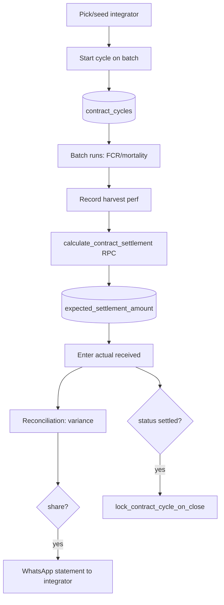

# Contract Farming & Settlement

## Purpose
For contract growers: track integrator-supplied inputs (chicks, feed, medicine), record
harvest performance, and compute the expected settlement from the integrator's tariff card —
then reconcile against what was actually received. Paid-plan feature.

## Entry points
- Web: `frontend/app/(dashboard)/contract/page.tsx`, `contract/new/ContractCycleForm.tsx`,
  detail `contract/[id]/page.tsx` (`CycleActions`), `contract/settlements/page.tsx`;
  integrators `integrators/page.tsx`, `integrators/new/IntegratorForm.tsx`.
- Mobile: `mobile-app/app/contract/index.tsx`, `contract/[id].tsx`
  (+ `components/ui/ContractReconciliationCard`, `ContractStatementModal`, `ContractTariffModal`).
- Backend: `integrators`, `contract_cycles`; RPC `calculate_contract_settlement()`; RPC
  `create_custom_integrator(name)`; trigger `lock_contract_cycle_on_close` (immutable when
  settled); Edge `send-farm-integrity-report` shares statements via WhatsApp.

## Step-by-step
1. Pick an integrator (pre-seeded: Suguna / Venkateshwara / Skylark / IB Group, each with a
   `tariff_card_json`) or add a custom one (`create_custom_integrator`).
2. Start a cycle bound to a batch: chicks supplied, feed/medicine supplied, expected harvest.
3. Cycle runs alongside the batch's daily logs (FCR, mortality accrue).
4. At harvest, record birds delivered, avg weight, actual FCR, actual mortality.
5. `calculate_contract_settlement()` applies the tariff card (base growing charge + FCR
   bonus + mortality bonus + weight target) → `expected_settlement_amount`.
6. Enter `actual_settlement_amount` received → reconciliation report (expected vs actual,
   variance) → optionally WhatsApp the statement to the integrator.
7. Status `settled` → `lock_contract_cycle_on_close` freezes the row.

## Flow map

## Data & backend
- Tables: `integrators` (read-all, service-write), `contract_cycles` (owner-only, immutable
  after settled). Settlement math is tariff-card-driven (`tariff_card_json`).
- Seed + RPC in `20260520000003_contract_farming_seed_and_rpc.sql`.

## Cross-app parity
Mobile has dedicated reconciliation/statement/tariff modals; web uses pages. Same RPC.

## Gaps
- **P1 — FIXED** — *Web had no way to auto-compute the expected settlement.* Mobile
  (`mobile-app/app/contract/[id].tsx:178` `recalcSettlement`) called
  `calculate_contract_settlement` and persisted `expected_settlement_amount`, but the web
  harvest form (`CycleActions.tsx`) only accepted a **manual** "Expected settlement" number —
  defeating the entire point of the tariff card. **Fix:** added a `recalcSettlement()` action +
  "Calculate expected settlement" button on web (`CycleActions.tsx`, shown once status is
  `harvest_complete`/`disputed` and tariff is confirmed) that calls the RPC, persists the
  result, refreshes, and shows the computed ₹. The manual field is retained as an optional
  override. Cross-app parity restored.
- **P2** — `calculate_contract_settlement` reads FCR/mortality from the **cycle's** recorded
  harvest fields (entered at harvest), not directly from daily-log-derived KPIs; if the user
  types figures that disagree with the batch KPIs the settlement uses the typed ones. Consider
  pre-filling the harvest form from computed batch KPIs.
- **P2** — Tariff cards are static JSON; the per-cycle `tariff_card_snapshot` (confirmed before
  settlement) covers mid-cycle card revisions, but there's no integrator-level card versioning.
- **P2 — FIXED 2026-06-18** — `CycleActions` accepted future harvest / settlement dates; now `<= today`.
- **P2 (proposed)** — `calculate_contract_settlement` authorizes on farm membership only, so a
  worker/vet can read settlement ₹ via the RPC though RLS blocks direct cycle reads. Tighten to
  owner/money (audit report 09).
- **P2 (verify M18)** — Contract is a paid-only feature but `contract_cycles` RLS gates owner/money,
  not `is_paid` — paid-feature DB gating to be decided in Billing.
