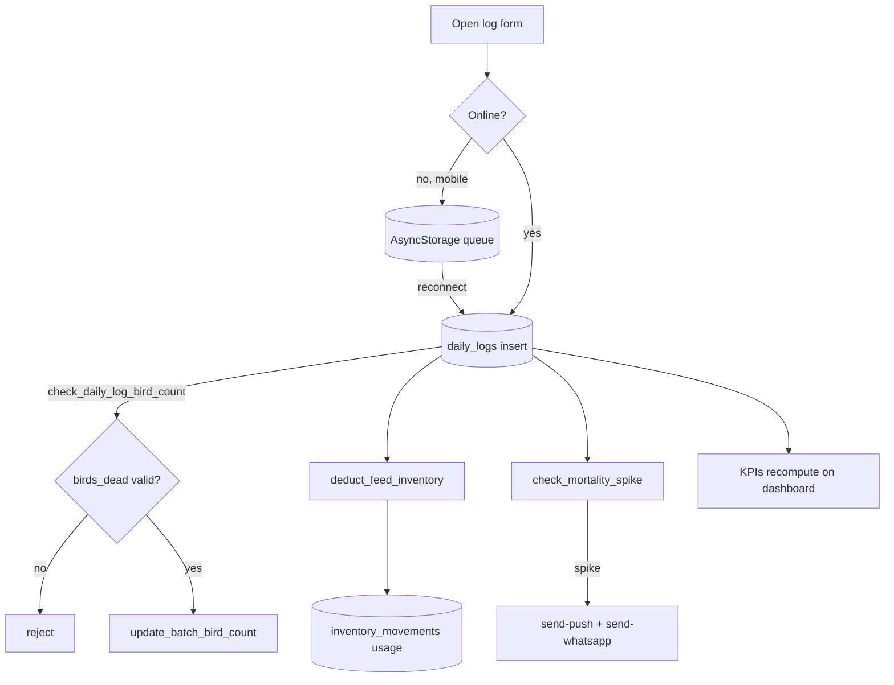

# Daily Log (+ offline queue)

## Purpose
The single most important data-entry flow: one row per batch per day capturing mortality,
feed, eggs and weight. A single insert cascades (via triggers) into bird-count updates,
inventory deduction and mortality alerts. Must work **offline** on mobile.

## Entry points
- Web: `frontend/app/(dashboard)/daily-log/new/DailyLogForm.tsx`, list `daily-log/page.tsx`,
  edit `daily-log/[id]/edit`. Global "Log entry" pill lives in the new `Topbar`.
- Mobile: `mobile-app/app/(tabs)/log.tsx` (+ `components/ui/DailyLogForm`), offline via
  `hooks/useOfflineQueue` + AsyncStorage; `components/ui/OfflineBanner`.
- Backend: triggers on `daily_logs` — `check_daily_log_bird_count` (guard),
  `update_batch_bird_count`, `check_mortality_spike` (→ edge), `deduct_feed_inventory`.

## Step-by-step
1. User opens the form, picks a batch, enters mortality / feed (type + kg) / eggs / weight.
2. **Online**: insert into `daily_logs` (UNIQUE `(batch_id, log_date)` prevents dupes).
   **Offline (mobile)**: row is queued in AsyncStorage; `OfflineBanner` shows pending count.
3. On insert, `check_daily_log_bird_count` rejects impossible mortality (> current birds).
4. `update_batch_bird_count` decrements `batches.current_bird_count` by `birds_dead`.
5. `deduct_feed_inventory` matches `feed_type` to a farm inventory item and writes an
   `inventory_movements` (usage) row → stock falls.
6. `check_mortality_spike` compares against threshold; if breached, posts to
   `send-push-notification` + `send-whatsapp-message` (via `tg_post_to_edge_function`).
7. When connectivity returns, the offline queue flushes; last-write-wins on the unique key.
8. **Edit/Delete** re-sync counts: `update_batch_bird_count_on_edit`,
   `restore_batch_bird_count_on_delete`, `cleanup_daily_log_movements`.

## Flow map

## Data & backend
- Tables: `daily_logs`, `batches` (count), `inventory_items` + `inventory_movements`,
  `weather_alerts`/push on spike.
- KPIs (FCR, livability, mortality %) computed in `@poultryos/shared` + `lib/kpis`, not stored.
- Concurrency: UNIQUE `(batch_id, log_date)` + last-write-wins is the documented conflict policy.

## Cross-app parity
Offline queue is **mobile-only** (per architecture: only daily log is offline-first). Web
requires connectivity. Both write the same `daily_logs` shape.

## Gaps
- **P1 (proposed fix)** — Daily-log **edits bypass the mortality guard**. `check_daily_log_bird_count`
  already computes the UPDATE delta but is bound BEFORE INSERT only, so editing `birds_dead` to an
  impossible value is accepted (count floors to 0). Fix = bind the same function BEFORE UPDATE
  (audit report 03). Not yet applied.
- **P2 — FIXED 2026-06-18** — Both web forms accepted future-dated logs; now `log_date <= today`
  (zod refine + `max` on the date input).
- **RESOLVED (was P1)** — The offline queue handles the unique-key collision gracefully. On
  flush, `mobile-app/lib/offline-queue.ts:125` uses `.upsert(payload, { onConflict:
  'batch_id,log_date' })`, so a queued row for a date already logged online becomes an UPDATE
  (last-write-wins, the documented policy) — no error, no silent loss. Failed rows increment
  `attempts` and are retried up to `MAX_ATTEMPTS` (5), staying visible in the queue.
- **P2** — On upsert-as-update the edit triggers (`update_batch_bird_count_on_edit`) fire rather
  than the insert ones — consistent, but worth a test asserting bird-count stays correct when an
  offline row overwrites an online row for the same day.
- **P2** — Web has no offline affordance by design; confirm it surfaces a clear error (not a
  silent drop) if connectivity is lost mid-save.
