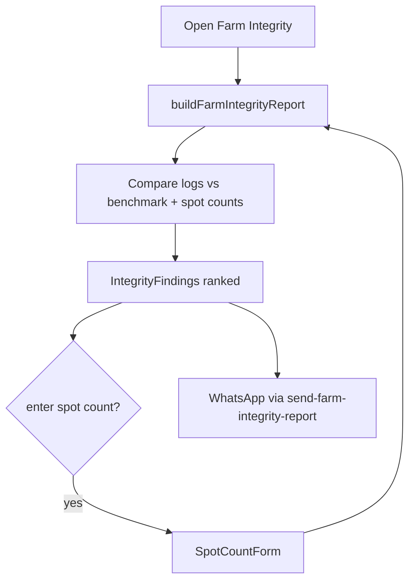

# Farm Integrity (Owner Trust)

## Purpose
Surface variances between what was *logged* and physical reality (spot counts, feed/stock
discrepancies) over a recent window, so an owner can spot worker error or theft. Items to
review, not conclusions. Paid feature.

## Entry points
- Web: `frontend/app/(dashboard)/farm-integrity/page.tsx`, `SpotCountForm.tsx` (wrapped in
  `UpgradeGate`).
- Mobile: `mobile-app/app/farm-integrity/index.tsx`.
- Backend: `buildFarmIntegrityReport` + `findBenchmark` in `@poultryos/shared`; Edge
  `send-farm-integrity-report` (**weekly PUSH digest**, Mon 09:00 IST). Reads daily logs, inventory,
  batches, `batch_harvests`, owner-only `physical_counts`.

## Step-by-step
1. The report engine (`buildFarmIntegrityReport`) compares logged figures vs benchmarks +
   physical spot counts over the last N days → a list of `IntegrityFinding`s (severity-ranked).
2. Owner can enter a quick **spot count** (`SpotCountForm`) for a shed/item to sharpen the
   check.
3. Findings render with severity on-screen. A weekly cron (`send-farm-integrity-report`, Mon 09:00
   IST) also **pushes** a concise non-accusatory summary to the owner when there's something to review.

## Flow map

## Data & backend
- Logic lives in `@poultryos/shared` (code, not a table). Reads `daily_logs`,
  `inventory_*`, `batches`. WhatsApp template for the report must be Meta-approved
  (project memory: a `farm_integrity` template submission was an open ops task).

## Cross-app parity
Both apps compute from the same shared engine. WhatsApp share on both.

## Gaps
- **P1 — FIXED 2026-06-18** — *False "missing birds" findings.* Both apps queried
  `batch_harvests.birds` (real column is `birds_harvested`), so the query errored, `soldByBatch` was
  empty, and `ledgerDrift = −sold` tripped a "review" finding on **every active batch with >5
  harvested birds** — even with no physical count. Fixed the column in web + mobile. (report 16, I1)
- **CLARIFIED (was "P1 WhatsApp")** — `send-farm-integrity-report` is **push-only by design**; it does
  **not** attempt WhatsApp (the `farm_integrity` template is deferred until Meta-approved, no invented
  IDs), so there is no failed-delivery path. The integrity flow has no WhatsApp share. Doc corrected.
- **P2** — Edge thresholds are duplicated from `packages/shared/src/farm-integrity.ts` (Deno can't
  import TS); currently in sync but at drift risk (report 16, I2).
- **P2** — Findings are heuristic; document the thresholds so owners trust the signal.
