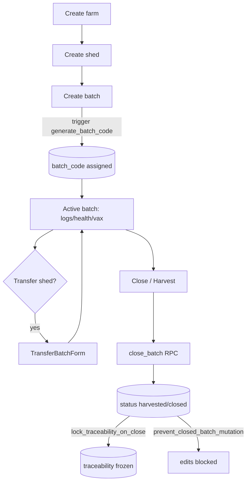

# Farm Setup (farms → sheds → batches)

## Purpose
Establish the physical + logical structure every other module hangs off: a **farm**
contains **sheds**, a shed holds **batches** (flocks). Batch placement starts the
lifecycle; batch closure ends it.

## Entry points
- Web: `frontend/app/(dashboard)/farms/new/FarmForm.tsx`,
  `sheds/new/ShedForm.tsx`, `batches/new/BatchForm.tsx`; detail `farms/[id]`,
  `batches/[id]` (with `CloseBatchForm`, `HarvestForm`, `TransferBatchForm`).
- Mobile: `mobile-app/app/setup/sheds.tsx`, `setup/batches.tsx`, `batches/[id].tsx`
  (Close/Transfer/Harvest modals in `components/ui`).
- Backend: trigger `generate_batch_code` (batch insert), guard `check_shed_disable`,
  RPC `close_batch()`, triggers `prevent_closed_batch_mutation` +
  `lock_traceability_on_close`.

## Step-by-step
1. Create farm (name, state/district, `farm_type` independent|contract, lat/long, UPI,
   heat threshold). Free plan = 1 farm.
2. Create shed(s) under the farm (capacity, poultry_type, status). Free plan = 3 sheds.
3. Create batch in a shed (breed, placement_date, opening_bird_count, cost/bird).
   `generate_batch_code` auto-assigns `batch_code`; `current_bird_count` seeds from opening.
4. Batch runs (daily logs, health, vaccinations accrue against it).
5. **Transfer** moves a batch to another shed (`TransferBatchForm`).
6. **Harvest / Close** via `close_batch()` RPC: records birds sold, weight, revenue →
   sets status `harvested`/`closed` → `lock_traceability_on_close` freezes the cert record,
   `prevent_closed_batch_mutation` blocks further edits.

## Flow map

## Data & backend
- Tables: `farms`, `sheds`, `batches`. `batches.total_sale_revenue` is GENERATED.
- Guards: `check_shed_disable` prevents disabling a shed with active batches.
- Freemium: farm/shed caps enforced via `is_paid()` at UI (`UpgradeGate`) and intended
  at DB — verify the DB-level cap exists for sheds/farms.

## Cross-app parity
Mobile funnels setup through `setup/sheds` + `setup/batches` (onboarding-style); web has
discrete `/sheds/new` + `/batches/new`. Same tables/RPCs.

## Gaps
- **P1 — FIXED 2026-06-18** — `CloseBatchForm` did a raw `batches` UPDATE that bypassed the
  `close_batch` RPC, so birds_sold could exceed the live count and harvest_date was unbounded.
  Now calls `close_batch` (owner-only + count + date guards). See audit report 02.
- **P1 — FIXED 2026-06-18** — `BatchForm` ignored shed capacity + type. Batch now inherits the
  shed's `poultry_type` and rejects `opening_bird_count` above shed capacity (mirrors
  `transfer_batch`). DB-level placement guard proposed (not yet applied).
- **P2** — `status='closed'` is unreachable from web (only `'harvested'` is set), so
  `lock_traceability_on_close` never fires → traceability never freezes (see Traceability M10).
- **P2** — harvested/closed batches are still **DELETE-able**; cascade wipes all child history.
  `prevent_closed_batch_mutation` guards UPDATE only. Propose a BEFORE DELETE guard.
- **RESOLVED (was P1)** — Shed transfer is correctly implemented. The `transfer_batch()` RPC
  (`20260615000000_batch_shed_transfers.sql`) is the single write path: it validates
  owner/admin + active batch + same-farm/active/type-compatible/capacity-checked destination,
  writes an immutable `batch_transfers` history row, and repoints `batches.shed_id` **in one
  transaction**. `current_bird_count` is a batch column, so it travels with the batch
  automatically — no re-point needed and no count loss. Web (`TransferBatchForm.tsx`) and mobile
  (`TransferBatchModal.tsx`) both call the same RPC.
- **P2** — Free-tier farm/shed caps are enforced **only in the UI** (`UpgradeGate`). There are
  **no `BEFORE INSERT` cap triggers** on `farms`/`sheds`; the DB only gates *paid features* via
  `is_paid()`. A direct PostgREST insert bypasses the quantity caps. Low risk (RLS still scopes
  to tenant) but the cap is not defence-in-depth. Same pattern across workers/buyers.
