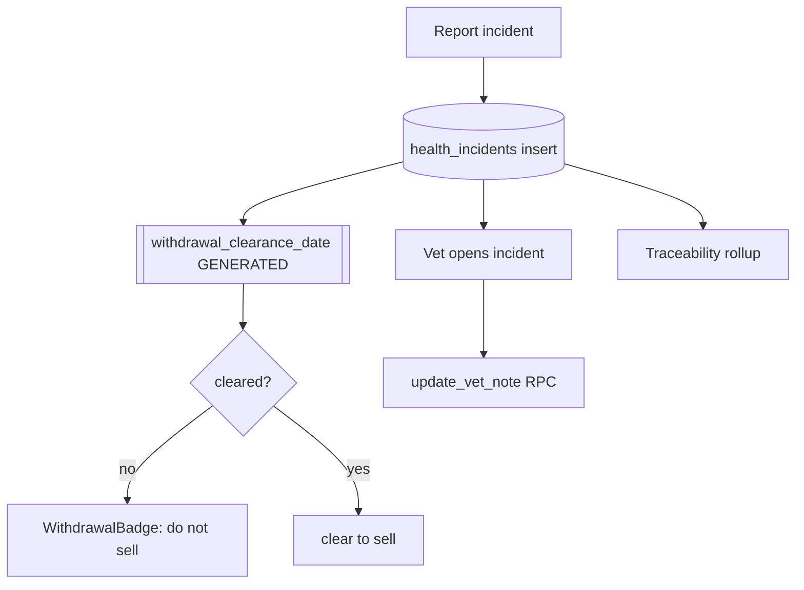

# Health Incidents & Withdrawal

## Purpose
Record disease/health events on a batch, the treatment given, and the medicine
**withdrawal period** so birds aren't sold before the drug clears. Vets can add notes.

## Entry points
- Web: `frontend/app/(dashboard)/health/new/HealthForm.tsx`, list `health/page.tsx`,
  detail `health/[id]/page.tsx`, edit `health/[id]/edit`, vet note `health/[id]/VetNoteForm.tsx`.
- Mobile: `mobile-app/app/health/index.tsx`, `health/new.tsx` (+ `components/ui/HealthIncidentForm`,
  `WithdrawalBadge`).
- Backend: `health_incidents` table; `withdrawal_clearance_date` is GENERATED from
  `incident_date + withdrawal_days`; RPC `update_vet_note(incident_id, note)`.

## Step-by-step
1. Owner/worker reports an incident: symptoms, affected count, vet consulted, diagnosis,
   treatment, medicine, dose, **withdrawal_days**.
2. `withdrawal_clearance_date` auto-computes; a `WithdrawalBadge` shows whether birds are clear.
3. Vet (role-scoped) opens the incident and adds a `vet_note` via `update_vet_note` RPC
   (vets can update ONLY the note, enforced by RLS).
4. Traceability rolls up `health_incidents_count` + `withdrawal_cleared` for the batch.

## Flow map

## Data & backend
- Table: `health_incidents`. RLS: owner full; **vet** = SELECT + UPDATE(`vet_note` only);
  worker = INSERT for assigned sheds, no financials.
- Feeds traceability cert fields (`health_incidents_count`, `withdrawal_cleared`).

## Cross-app parity
Mobile + web both write `health_incidents`; vet-note flow is primarily web (vets are
desktop users). Confirm mobile surfaces the withdrawal badge on batch detail.

## Gaps
- **P1 — FIXED 2026-06-18 (frontend)** — Vet edits went through a raw table UPDATE and the RLS
  policy granted vets table-wide write (could alter withdrawal_days/diagnosis). `VetNoteForm` now
  calls the column-restricted `update_vet_note` RPC; RLS narrowing to owner/admin proposed (report 04).
- **P1 — FIXED 2026-06-18 (frontend warning)** — Sale flows ignored withdrawal. Close/Harvest forms
  now show a red withdrawal warning when a batch has an un-cleared clearance date. Optional DB-level
  block proposed but deliberately left as a warning (selling unaffected birds is legitimate).
- **P2 — FIXED 2026-06-18** — `HealthForm` accepted future incident dates / affected counts above
  the live flock; both now guarded.
- **P2** — No reminder when a withdrawal period is about to clear (could WhatsApp the owner).
