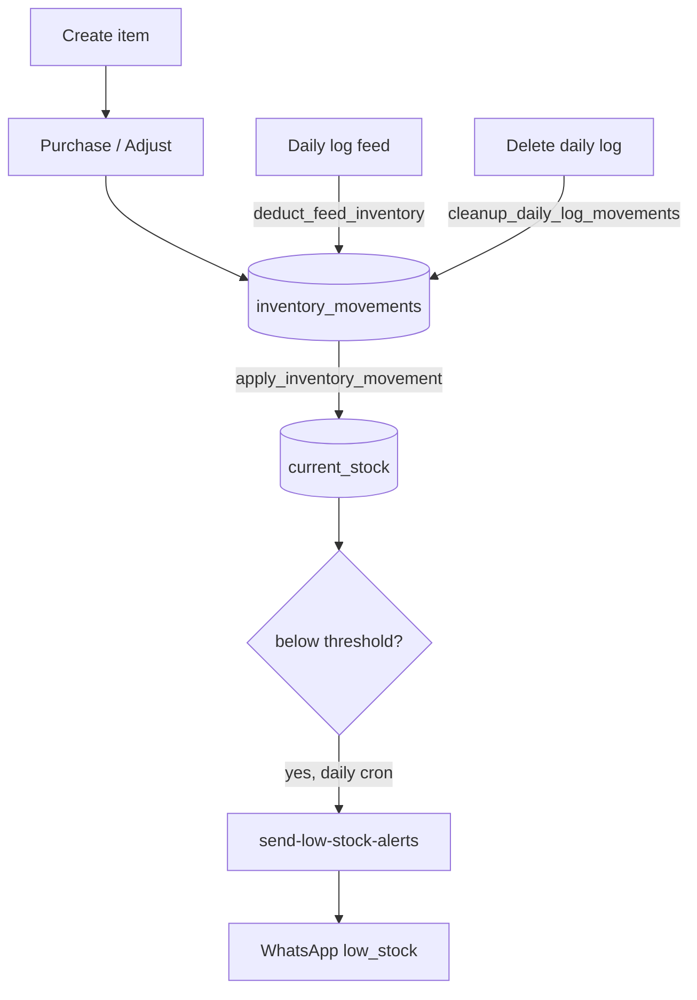

# Inventory & Feed Auto-Deduct

## Purpose
Track feed/medicine/equipment stock, auto-deduct feed as daily logs are entered, compute
days-of-stock burn rate, and alert on low stock.

## Entry points
- Web: `frontend/app/(dashboard)/inventory/page.tsx`, `inventory/new/InventoryItemForm.tsx`,
  `inventory/purchase/PurchaseForm.tsx`, detail `inventory/[id]` (`AdjustStockForm`), edit.
- Mobile: `mobile-app/app/inventory/index.tsx`, `inventory/new.tsx`
  (+ `components/ui/InventoryItemCard`, `StockMovementRow`, `PurchaseEntryForm`).
- Backend: `inventory_items`, `inventory_movements`; trigger `apply_inventory_movement`
  (movement → stock delta); `deduct_feed_inventory` (from daily log); cron
  `send-low-stock-alerts` (03:00 UTC / 08:30 IST); RPC `get_low_stock_items(farm_id)`.

## Step-by-step
1. Create an inventory item (name, category, unit, current_stock, low_stock_threshold).
2. **Purchase** writes an `inventory_movements` (purchase) row → `apply_inventory_movement`
   adds to stock. **Adjustment** writes an adjustment movement.
3. Entering a **daily log** with feed → `deduct_feed_inventory` writes a usage movement
   matched by `feed_type` within the farm → stock falls.
4. Burn rate (last 7 days of feed usage) → days-of-stock, shown on the inventory screen
   (`dailyBurnByFeedType` / `feedStockStatus` in `@poultryos/shared`).
5. Daily cron `send-low-stock-alerts` uses `get_low_stock_items` → WhatsApp `low_stock_alert`.
6. Deleting a daily log → `cleanup_daily_log_movements` reverses its usage movement.

## Flow map

## Data & backend
- Tables: `inventory_items`, `inventory_movements`. Stock is derived purely from movements
  via `apply_inventory_movement` — never written directly (keeps an audit trail).
- Burn-rate math is client/shared, not stored.

## Cross-app parity
Same tables both apps. Feed auto-deduct is a DB trigger, so it fires regardless of which
app entered the daily log.

## Gaps
- **P1 (proposed fix)** — **Stock is not restored when a movement is deleted.**
  `apply_inventory_movement` has a DELETE-reversal branch but is bound AFTER INSERT only, so
  deleting a daily log (→ `cleanup_daily_log_movements`) removes the usage row without adding
  feed back to stock. Fix = add an AFTER DELETE trigger binding (audit report 06). Not applied.
- **RESOLVED** — Feed match silent no-op is mitigated: `DailyLogForm` warns when feed used has no
  matching stock item (verified in M3).
- **P2 — FIXED 2026-06-18** — `PurchaseForm` accepted future-dated purchases; now `<= today`.
- **P2** — Medicine/vaccine stock isn't auto-deducted by health/vaccination entries (feed only).
