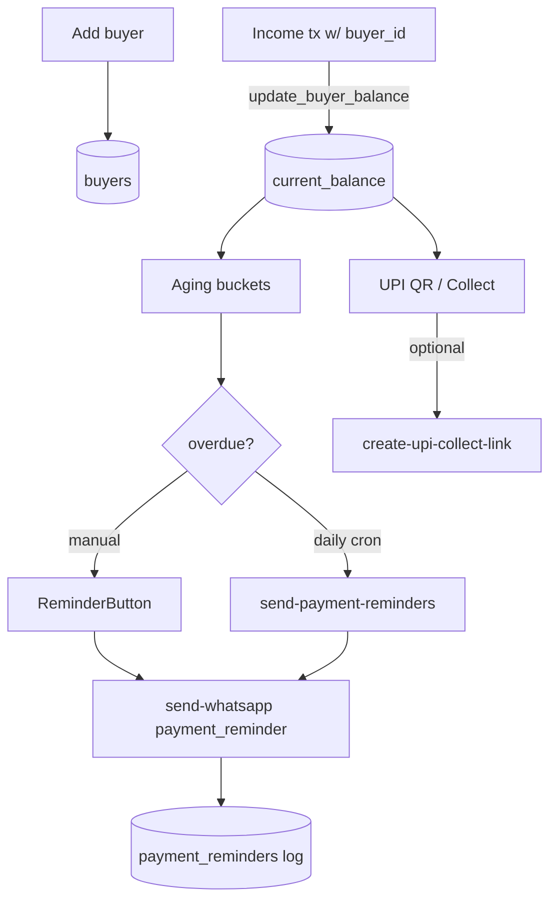

# Khata / UPI

## Purpose
A per-buyer credit ledger ("khata"): track what each buyer owes, age the receivables,
nudge them via WhatsApp, and collect via UPI (client-side QR + optional Razorpay UPI Collect).

## Entry points
- Web: `frontend/app/(dashboard)/khata/page.tsx`, `khata/new/BuyerForm.tsx`, detail
  `khata/[id]/page.tsx` (`BuyerActions` = UPI QR + WhatsApp reminder), edit, aging
  `khata/aging/page.tsx` (`ReminderButton`).
- Mobile: `mobile-app/app/(tabs)/khata.tsx`, `buyers/new.tsx`, `buyers/[id].tsx`
  (+ `components/ui/BuyerCard`, `KhataLedgerRow`, `UpiQrModal`, `WhatsAppShareButton`).
- Backend: `buyers`, `payment_reminders`; trigger `update_buyer_balance`; cron
  `send-payment-reminders` (04:30 UTC / 10:00 IST); `create-upi-collect-link` Edge Function.

## Step-by-step
1. Add a buyer (name, phone/whatsapp, credit_limit). Free plan = 10 buyers.
2. Income transactions linked to the buyer update `current_balance` via `update_buyer_balance`
   (positive = buyer owes the farmer).
3. **Aging** buckets outstanding income by days overdue (0-7 / 8-15 / 16-30 / 30+).
4. **UPI QR**: client builds a BHIM URI `upi://pay?pa=<farm.upi_id>&pn=&am=&cu=INR&tn=`
   and renders it (`UpiQrModal`) — zero network. Optionally `create-upi-collect-link`
   generates a Razorpay UPI Collect link for auto-confirmation.
5. **Reminder**: manual `ReminderButton` or daily cron `send-payment-reminders` (day 7/15/30)
   → WhatsApp `payment_reminder` template → logged in `payment_reminders`.

## Flow map

## Data & backend
- Tables: `buyers`, `payment_reminders`, `financial_transactions`. RLS: owner-only.
- UPI QR is fully client-side (no cost); Razorpay UPI Collect is the auto-confirm upgrade.

## Cross-app parity
Mobile has the richer UPI experience (`UpiQrModal`, WhatsApp share on device). Web offers
the same actions via `BuyerActions`. Balance logic is a shared DB trigger.

## Gaps
- **RESOLVED** — VPA validation before QR build is already handled: `UpiQrModal` calls
  `isValidVpa` (shared impl) and refuses to render on null/invalid. (verified 2026-06-18)
- **P1 (inherited T1 — apply-now)** — Buyer detail reads the **stored** `current_balance`, which
  `update_buyer_balance` only refreshes on INSERT. After Mark-paid the page, UPI QR amount, and
  WhatsApp reminder all show the stale outstanding. Fixed by the M7 AFTER UPDATE/DELETE binding.
- **P2 — FIXED 2026-06-18** — WhatsApp reminder leaked a literal "(set UPI ID)" when no farm UPI;
  the UPI line is now included only when a real VPA exists.
- **P1 (verify in M18)** — UPI Collect auto-confirm must flip the linked income's `payment_status`
  via the Razorpay webhook — verified there.
- **P2** — Free-tier 10-buyer cap is UI-only (covered by the M2 cap-trigger proposal).
