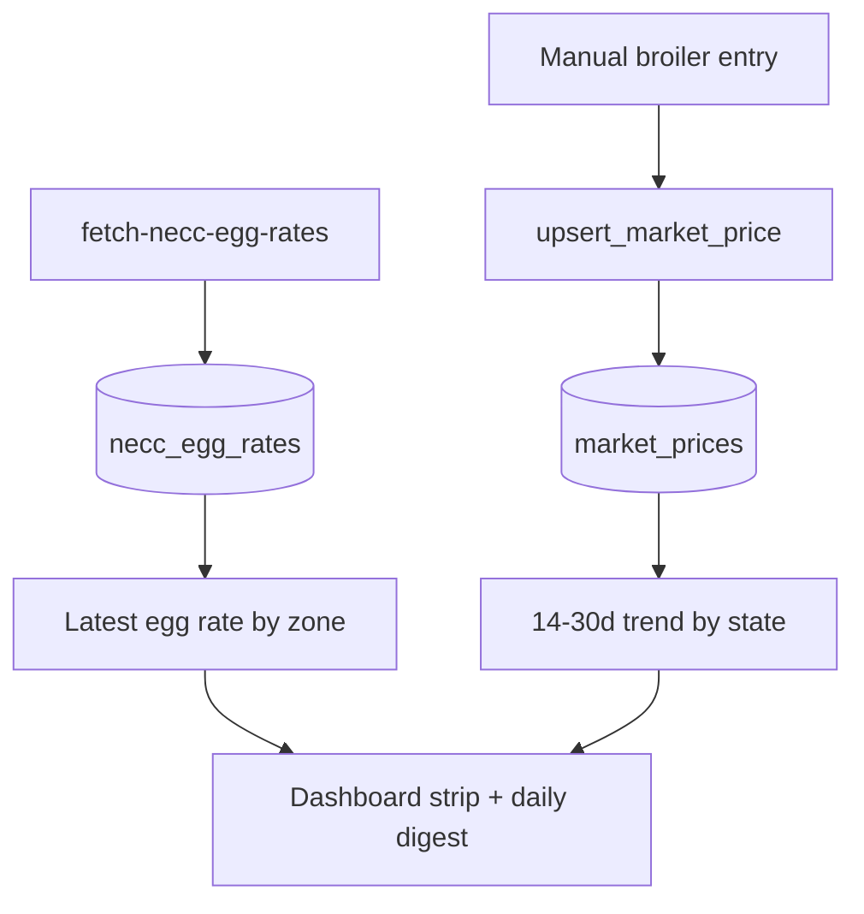

# Market Prices

## Purpose
Show current broiler + egg rates and a 14–30 day trend per state, plus NECC zonal egg
rates, to inform sell-timing and P&L benchmarks.

## Entry points
- Web: `frontend/app/(dashboard)/market-prices/page.tsx` (`PriceTrend`),
  manual entry `market-prices/new/PriceEntryForm.tsx`.
- Mobile: `mobile-app/app/market-prices/index.tsx`; dashboard `components/ui/MarketPriceStrip`.
- Backend: `market_prices`, `necc_egg_rates`; cron/Edge `fetch-necc-egg-rates`; RPC
  `upsert_market_price()`; helpers `stateDefaultZone`, `eggRatePerPiece`, `eggRatePerTray`
  in `@poultryos/shared`.

## Step-by-step
1. NECC egg rates auto-fetch via `fetch-necc-egg-rates` (zonal) into `necc_egg_rates`.
2. A farm tracks a NECC zone (explicit `farms.necc_zone` or `stateDefaultZone(state)`).
3. **Broiler prices** are entered manually (`PriceEntryForm` → `upsert_market_price`) — the
   manual fallback for when no feed is available.
4. The screen renders latest-by-zone egg rate + a multi-day broiler/egg trend by state.
5. The dashboard strip + daily digest read the latest prices.

## Flow map

## Data & backend
- Tables: `market_prices` (UNIQUE state+date), `necc_egg_rates`. NECC fetch in the
  `fetch-necc-egg-rates` function; broiler via the manual RPC only.

## Cross-app parity
Mobile shows a compact strip; web shows the full trend. Both read the same tables.

## Gaps
- **P1 — FIXED 2026-06-18** — *Web manual price entry was broken.* `PriceEntryForm` wrote via a
  direct `market_prices` upsert, but the table has **SELECT-only RLS** (no INSERT policy) so every
  save was rejected. Switched to the `upsert_market_price` RPC (mobile already used it), inheriting
  owner-in-state + date≤today + non-negative guards; added a client future-date guard. (report 11, M1)
- **P1 (G3) — still open (UI copy FIXED)** — There is **no automated broiler price fetch**
  (`fetch-market-prices` Edge Function does not exist); broiler prices are manual entry only via
  the `upsert_market_price()` RPC. Only **NECC egg rates** auto-fetch. The empty-state copy in
  `market-prices/page.tsx:95` used to promise a non-existent "fetch-market-prices cron at 08:00
  IST" — **fixed** to "NECC egg rates update daily after 8 AM IST; add broiler prices manually".
  The underlying gap (no broiler source) remains a product decision: build a broiler feed or
  keep manual entry.
- **RESOLVED (was P2)** — `fetch-necc-egg-rates` **is** scheduled (migration
  `20260616000003`, daily ~08:00 IST), so egg rates refresh automatically.
