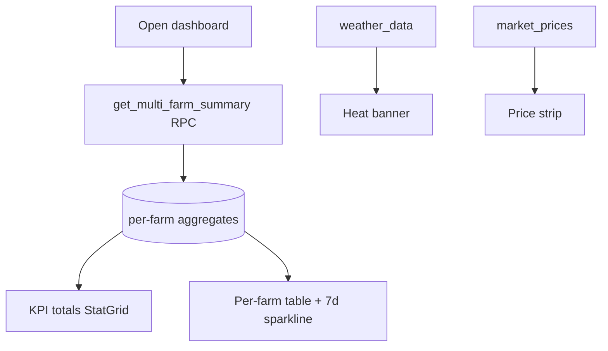

# Multi-Farm Dashboard

## Purpose
A consolidated view of KPIs, P&L and receivables across every farm a user owns/manages —
one screen. Paid feature; the web "home" after login.

## Entry points
- Web: `frontend/app/(dashboard)/multi-farm/page.tsx` (wrapped in `UpgradeGate`).
- Mobile: `mobile-app/app/multi-farm/index.tsx`.
- Backend: RPC `get_multi_farm_summary()` (returns per-farm aggregates); reads
  `weather_data`, `market_prices`, `daily_logs` (7-day sparkline).

## Step-by-step
1. `get_multi_farm_summary()` returns one row per farm (active batches, birds, mortality %,
   feed, income/expense/net P&L, receivables, last log date).
2. The page also pulls latest weather (heat banner), latest market prices, and a 7-day
   mortality sparkline per farm.
3. Totals are summed into the KPI tiles (`StatGrid`); each row links to the farm detail.

## Flow map

## Data & backend
- RPC in `20260520000005_multi_farm_summary_rpc.sql`. Aggregation is server-side (one round
  trip) for performance.

## Cross-app parity
Web is the primary multi-farm surface (CLAUDE.md: "web only" originally); mobile has a
lighter version. Both call the same RPC.

## Gaps
- **P1 (proposed)** — *Receivables overstated.* `get_multi_farm_summary` sums the **full** `amount`
  for `partial` income, ignoring `amount_paid`, so the consolidated receivables disagree with the
  Khata buyer-balance (which nets `amount_paid`). Proposed: mirror the `update_buyer_balance` formula
  in the receivables CTE (report 15, D1). Verified scoping is otherwise airtight (owner/accepted
  member only, IST month, no cross-tenant leak).
- **P2** — `mortality_pct_month` mixes a monthly death numerator with an all-time opening denominator;
  define one canonical month-mortality % shared with the batch view (report 15, D2).
- **P2** — Single-farm users see a one-row dashboard behind a paid gate; confirm the gate copy
  makes the multi-farm value clear (it's low-value for a 1-farm free user).
