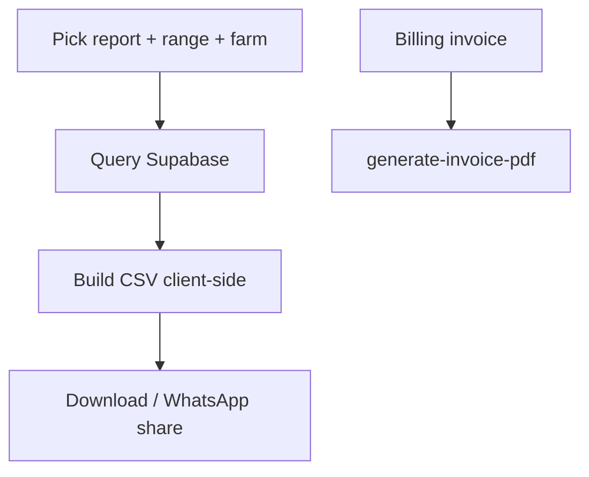

# Reports / Exports

## Purpose
Let owners export their data (daily logs, transactions, batch performance) for accounting
or record-keeping.

## Entry points
- Web: `frontend/app/(dashboard)/reports/page.tsx`, `ReportExports.tsx`.
- Mobile: `mobile-app/app/reports/index.tsx`.
- Backend: none required for CSV (client-side); `generate-invoice-pdf` exists for billing
  invoices (a separate flow).

## Step-by-step
1. User picks a report type + date range + farm.
2. The client queries Supabase and builds a **CSV** in-browser/device, then downloads/shares it.
3. (Billing invoices use the dedicated `generate-invoice-pdf` Edge Function — see
   [billing-subscription.md](billing-subscription.md).)

## Flow map

## Data & backend
- Reads existing tables (`daily_logs`, `financial_transactions`, `batches`). No report tables.

## Cross-app parity
Both apps produce CSV. Mobile can WhatsApp-share the file (`expo-sharing`).

## Gaps
- **P1 — FIXED 2026-06-18** — *Reports had no paid gate* though "Full export" is a paid feature.
  Wrapped the page in `UpgradeGate` (server `is_paid()` RPC), matching multi-farm/contract. (report 14, R1)
- **P1 — FIXED 2026-06-18** — *CSV formula-injection*: free-text fields beginning with `= + - @`
  could execute as spreadsheet formulas. `toCsv` now apostrophe-prefixes such cells. (report 14, R2)
- **P1 — FIXED 2026-06-18** — *exports silently truncated at PostgREST's 1000-row cap*; added a
  `fetchAll` pagination loop so the full set is exported. (report 14, R3)
- **P2 (G2)** — No `generate-report-pdf` Edge Function; reports are CSV-only **by decision** (the page
  copy already says "CSV exports"). Docs aligned to CSV-only rather than building a redundant function.
- **P2** — `batches` export is all-time but the filename still embeds the date range (cosmetic).
