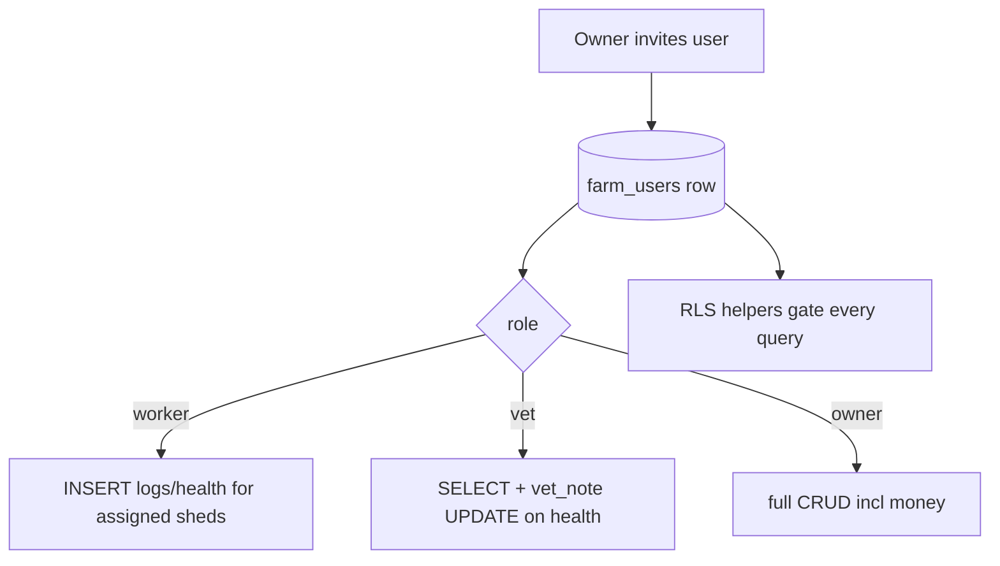

# Team & Roles (RLS)

## Purpose
Let an owner invite workers and vets with scoped access, enforced by Row-Level Security so
the data boundary is in the database, not just the UI.

## Entry points
- Web: `frontend/app/(dashboard)/team/page.tsx`, `team/InviteForm.tsx`.
- Mobile: invites surfaced under settings/more.
- Backend: `farm_users` (membership + `assigned_shed_ids`); RLS helpers `user_role_for_farm`,
  `user_assigned_sheds`, `is_farm_owner`, `is_farm_member`; tenant helpers `is_tenant_member`,
  `tenant_role`, `is_tenant_admin`, `is_tenant_money`.

## Step-by-step
1. Owner invites a user **by phone** (`team/InviteForm.tsx:39`). The invitee **must already
   have a PoultryOS profile** — the form looks up `profiles` by phone and errors if none
   exists ("ask them to sign up first"). There is no email-only / pre-account invite.
2. A `farm_users` row is inserted with `invited_at`. **Access is granted immediately**: the
   RLS helpers (`user_role_for_farm`, `is_farm_member`, `user_assigned_sheds`) gate on row
   **existence only**, not on `accepted_at`. So `accepted_at` is effectively cosmetic for
   access — there is no separate "accept" step the invitee must complete to use the farm.
3. RLS then governs every query:
   - **Owner**: full CRUD on the farm's data incl. money, buyers, contracts.
   - **Worker**: INSERT `daily_logs` + `health_incidents` for **assigned sheds** only;
     SELECT own-farm data; NO financials/buyers.
   - **Vet**: SELECT + UPDATE(`vet_note` only) on `health_incidents`; NO financials/buyers.
4. Freemium: free plan = 2 workers; vet access = paid.

## Flow map

## Data & backend
- Table: `farm_users` (UNIQUE farm+user). Role logic centralised in the RLS helper functions
  (denormalised `farm_id` on data tables keeps policies JOIN-free for performance).

## Cross-app parity
RLS is enforced in the DB, so both apps get identical access boundaries regardless of UI.

## Gaps
- **SECURITY VERIFIED** — **No RLS policy trusts `profiles.role`** (which `handle_new_user` defaults
  to `owner` for everyone). All authz derives from `farm_users`/`tenant_users` helpers; a
  `farm_users.role='owner'` grants only membership (owner power = `farms.owner_id`). M1→M17 concern
  resolved (report 17).
- **P1 — FIXED 2026-06-18** — *Web-invited workers couldn't log anything.* `InviteForm` never set
  `assigned_shed_ids` (and no edit UI existed), so `user_assigned_sheds = '{}'` and the worker
  `daily_logs` INSERT policy rejected every insert. Added a required shed multi-select to the invite
  form (workers); writes `assigned_shed_ids`. (report 17, T1)
- **P2 — FIXED 2026-06-18** — `accepted_at` was never set → "Pending" forever + member's farms
  excluded from their own `get_multi_farm_summary`. Invite now sets `accepted_at = now()` (access is
  immediate anyway). (report 17, T2)
- **P2** — Free-tier caps (2 workers, vet-paid) are enforced **nowhere** (not UI, not DB). Folded into
  the consolidated cap-trigger backlog: free ≤ 2 workers on `farm_users`; `vet` requires `is_paid`.
- **P2** — Mobile has no first-class invite UI; team membership on mobile arrives via the
  onboarding RPC (which auto-sets `accepted_at`).
