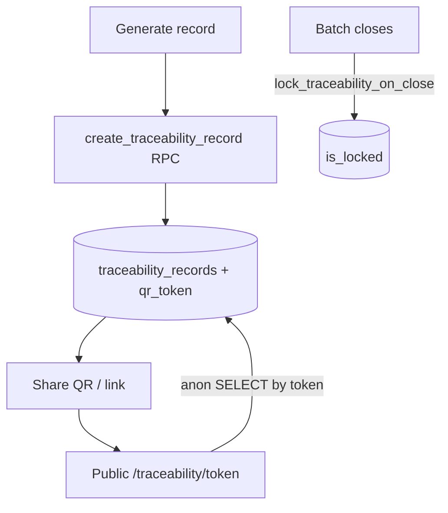

# Traceability

## Purpose
A public farm-to-plate provenance record per batch, shareable via QR/link, summarising
supplier, vaccinations, health incidents and withdrawal clearance. Paid feature to create.

## Entry points
- Web: `frontend/app/(dashboard)/traceability/page.tsx`, `ShareTraceability.tsx`; public page
  `frontend/app/traceability/[token]/page.tsx` (anon, server-side QR via `qrcode`).
- Mobile: `mobile-app/components/ui/TraceabilityModal`.
- Backend: `traceability_records`; RPC `create_traceability_record()`; trigger
  `lock_traceability_on_close` (freezes when the batch closes); token-scoped anon access in
  `20260615000001_traceability_token_scoped_access.sql`.

## Step-by-step
1. Owner generates a record for a batch (`create_traceability_record`) → unique `qr_token`,
   rolls up supplier, `total_vaccinations`, `health_incidents_count`, `withdrawal_cleared`.
2. Share the public URL `/traceability/<token>` or its QR (`ShareTraceability`).
3. Anyone (anon) opens the public page; RLS allows SELECT by `qr_token` only.
4. When the batch closes, `lock_traceability_on_close` sets `is_locked` so the record can't
   change after sale.

## Flow map

## Data & backend
- Table: `traceability_records` (UNIQUE batch_id, UNIQUE qr_token). RLS: anon SELECT by
  token only — the one public-data path in the app.

## Cross-app parity
Creation/share on both; the public page is web-only (a shareable URL), which is correct.

## Gaps
- **P1 — FIXED 2026-06-18** — *Web could not issue a certificate at all.*
  `create_traceability_record` was mobile-only; the web had list + share + public page but no
  create path, and batch-detail actions render only while `status='active'`. **Fix:** added
  `batches/[id]/GenerateCertificate.tsx` (calls the same owner-gated RPC) + a section on the batch
  detail page for harvested/closed batches — Generate, then View & share. Web/mobile parity restored.
- **P2 — FIXED 2026-06-18** — public certificate PDF (`DownloadCertificate.tsx`) hardcoded the
  retired Kraken purple `#7132f5`; remapped to ink `#292524` (`colors.primary`).
- **RESOLVED (historical P0 — anon RLS leak)** — there is **no anon table policy**; the only public
  path is `get_traceability_by_token` (SECURITY DEFINER, exact `qr_token`, `LIMIT 1` — no
  enumeration). Verified against the live DB.
- **RESOLVED (cross-module M2 — lock never fired)** — `create_traceability_record` itself flips a
  `harvested` batch → `closed`, firing `lock_traceability_on_close`; the record is re-fetched locked.
- **P1 (G1)** — `certificate_pdf_url` is never populated (no `generate-traceability-pdf` Edge
  Function). Its conditional "Download full certificate (PDF)" link never renders; the client-side
  jsPDF `DownloadCertificate` already covers the PDF + WhatsApp promise. Recommendation: drop the
  dead column/link rather than build a redundant Edge Function (audit report 10, T4).
- **P2 (proposed)** — a cert generated on an already-`closed` batch isn't locked (lock trigger
  already fired). Propose `is_locked = (batch.status='closed')` at insert (report 10, T3).
- **P2 (verify M18)** — traceability is paid-only but `create_traceability_record` checks owner, not
  `is_paid` — paid-feature DB gating to be decided in Billing (with M9-C3).
