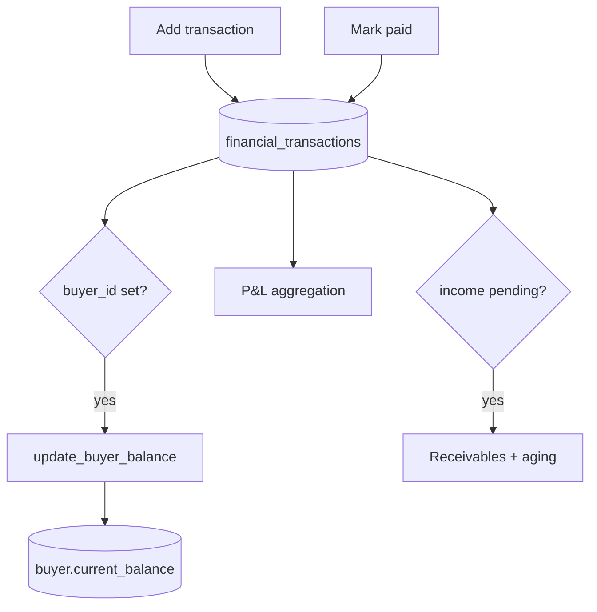

# Transactions (Income / Expense)

## Purpose
Record money in/out per farm and batch, track payment status (paid/pending/partial), and
feed P&L + receivables. Income linked to a buyer drives the Khata ledger.

## Entry points
- Web: `frontend/app/(dashboard)/transactions/page.tsx`, `transactions/new/TransactionForm.tsx`,
  edit `transactions/[id]/edit`, `MarkPaidButton.tsx`; P&L `batches/[id]/pnl/page.tsx`.
- Mobile: `mobile-app/app/transactions/index.tsx`, `transactions/new.tsx`
  (+ `components/ui/TransactionForm`).
- Backend: `financial_transactions`; trigger `update_buyer_balance` (I/U/D, when `buyer_id`
  set); `check_payment_overdue()` (used by payment-reminders cron).

## Step-by-step
1. Add a transaction: type (income|expense), category, amount, quantity, price/unit, party,
   date, payment_status, due_date; income may link a `buyer_id`.
2. If `buyer_id` is set, `update_buyer_balance` recomputes that buyer's `current_balance`
   and `total_business_volume` (see [khata-upi.md](khata-upi.md)).
3. **Mark paid** updates `payment_status` → balance/aging recompute.
4. P&L (`batches/[id]/pnl`) aggregates income/expense per batch; receivables = sum of
   pending/partial income.

## Flow map

## Data & backend
- Table: `financial_transactions` (denormalised `farm_id`). RLS: **owner-only** for money
  (workers/vets excluded).
- Overdue logic: `check_payment_overdue()` (fixed in `20260504000000`) feeds reminders.

## Cross-app parity
Same table both apps; money screens are owner-only on both. Mobile mirrors the web form.

## Gaps
- **P1 (proposed fix — apply ASAP)** — **Buyer balance only recomputes on INSERT.**
  `update_buyer_balance` is bound AFTER INSERT only, but the function is built for I/U/D. So
  **"Mark paid", edits, and deletes leave `buyers.current_balance` stale** — receivables keep
  showing paid invoices as outstanding. Fix = add an AFTER UPDATE OR DELETE binding (report 07).
- **RESOLVED (was P1)** — `partial` math: `TransactionForm` requires `amount_paid ∈ (0, amount)`
  and the functions use it; the `0.5` is only a fallback for rows missing `amount_paid`.
- **P2 — FIXED 2026-06-18** — `TransactionForm` accepted future-dated transactions; now `<= today`.
- **P2** — On edit, reassigning `buyer_id` leaves the old buyer's balance stale (T3, report 07).
- **P2** — No recurring/expense templates; every entry is manual.
