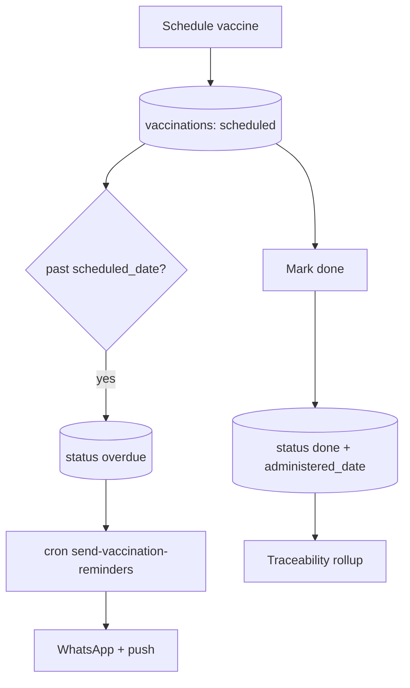

# Vaccinations

## Purpose
Schedule vaccines per batch, track scheduled/overdue/done status, and remind owners
the day a dose is due via WhatsApp + push.

## Entry points
- Web: `frontend/app/(dashboard)/vaccinations/new/VaccinationForm.tsx`, list
  `vaccinations/page.tsx` (grouped overdue/scheduled/done), edit `vaccinations/[id]/edit`,
  `MarkDoneButton.tsx`.
- Mobile: `mobile-app/app/vaccinations/index.tsx`, `vaccinations/new.tsx`
  (+ `components/ui/VaccinationCard`, `Timeline`).
- Backend: `vaccinations` table; cron `send-vaccination-reminders` (01:30 UTC / 07:00 IST)
  → `send-whatsapp-message` + `send-push-notification`.

## Step-by-step
1. Schedule a vaccine for a batch (name, scheduled_date, dose, route, birds).
2. Status starts `scheduled`; becomes `overdue` once past date without administration.
3. Daily cron `send-vaccination-reminders` finds due/overdue doses and sends a WhatsApp
   `vaccination_reminder` template + push.
4. User taps **Mark done** → records `administered_date` + `administered_by`, status `done`.
5. Traceability rolls up `total_vaccinations` for the batch.

## Flow map

## Data & backend
- Table: `vaccinations`. Cron defined in `20260519000003_schedule_vaccination_reminders.sql`.
- Reminder routing always pairs WhatsApp + push (see [whatsapp-notifications.md](whatsapp-notifications.md)).

## Cross-app parity
Identical table both apps. Web groups by status; mobile uses a timeline. Mark-done writes
the same fields.

## Gaps
- **P1 (proposed fix)** — **Overdue doses are never re-reminded.** The cron sweeps past-due rows to
  `overdue` (`scheduled_date < today`) but the due query filters `scheduled_date >= today`, so no
  overdue row matches. A missed vaccine is dropped from all future reminders. Fix = include a
  lookback window in the due query (audit report 05). Not applied.
- **P1 (proposed fix)** — **WhatsApp reminder never sent.** The cron only posts to
  `send-push-notification`; the documented `vaccination_reminder` WhatsApp template is not wired.
- **P2 — FIXED 2026-06-18** — `MarkDoneButton` now records `administered_by` (was date+status only).
- **P2** — UPDATE is owner/admin only → a worker can't "Mark done" a dose they gave. Confirm intent.
- **P2** — No per-breed default vaccination schedule seeding; every dose is manual.
