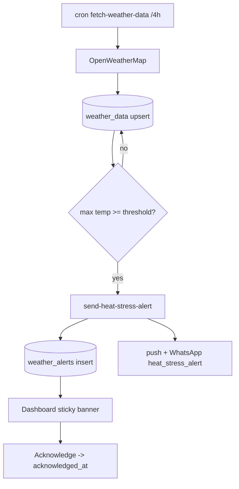

# Weather & Heat-Stress Alerts

## Purpose
Cache per-farm weather forecasts and warn owners before a heat-stress event so they can
act (water, foggers, reduce feed). Heat is a top mortality driver for Indian poultry.

## Entry points
- Web: `frontend/app/(dashboard)/weather/page.tsx`; dashboard widget + multi-farm heat banner.
- Mobile: `mobile-app/app/weather/index.tsx`; dashboard `components/ui/WeatherWidget` +
  `HeatStressBanner`.
- Backend: cron `fetch-weather-data` (every 4h) → OpenWeatherMap → upsert `weather_data` →
  on threshold breach calls `send-heat-stress-alert` → inserts `weather_alerts` +
  `send-push-notification` + `send-whatsapp-message`.

## Step-by-step
1. Cron `fetch-weather-data` iterates farms with lat/long, fetches OpenWeatherMap, upserts
   `weather_data` (current temp/humidity, 72h forecast JSON, `max_temp_today` GENERATED).
2. If forecast max temp ≥ farm's `heat_stress_threshold_celsius`, it triggers
   `send-heat-stress-alert`.
3. That inserts a `weather_alerts` row (severity warning/critical, mitigation actions) and
   fans out push + WhatsApp `heat_stress_alert`.
4. Dashboard shows a sticky heat banner; user taps **Acknowledge** → sets `acknowledged_at`.

## Flow map

## Data & backend
- Tables: `weather_data`, `weather_alerts`. Cron in `20260519000002_schedule_weather_cron.sql`.
- API budget: free OpenWeatherMap (1k/day) → 4-hourly cache keeps within quota.

## Cross-app parity
Both apps read `weather_data`/`weather_alerts` (any farm member may SELECT). Alerts are
generated server-side, so both apps see them.

## Gaps
- **P1 — FIXED 2026-06-18** — *Farms without lat/long get no weather*, and the **edit** form had no
  way for an owner to supply coordinates they don't know (raw number fields only). Existing farm
  `MAMA` had NULL coords. **Fix:** added a "📍 Use my current location" geolocation button to
  `farms/[id]/edit/EditFarmForm.tsx` (mirrors onboarding), giving existing farms a one-tap backfill.
  (report 12, W1 — resolves the M1 cross-module item.)
- **VERIFIED** — `send-heat-stress-alert` is idempotent and fans out **push + opt-in WhatsApp**
  (template `heat_stress_alert`), warn-and-continue per channel; `fetch-weather-data` is
  service-role-locked and skips NULL-coord farms. Phase-2 alert-parity gate met.
- **P2 (proposed)** — `weather_alerts` member-ack UPDATE policy is column-wide; any member can
  rewrite server-generated alert fields. Propose an `acknowledge_weather_alert` RPC + drop the broad
  policy (report 12, W2).
- **P2** — Threshold is a single per-farm value; no per-breed calibration (CLAUDE.md risk note
  on false positives).
