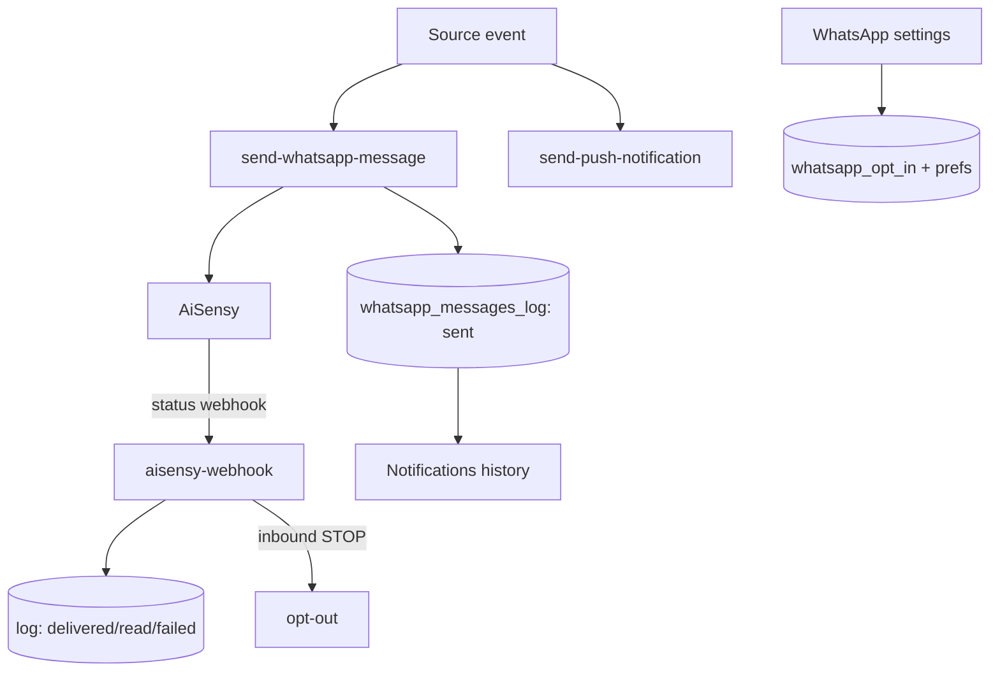

# WhatsApp & Notifications

## Purpose
The shared messaging backbone. Almost every alert in the app fans out through one Edge
Function (`send-whatsapp-message`) plus push (`send-push-notification`), with a full audit
log and per-category opt-out.

## Entry points
- Web: settings `frontend/app/(dashboard)/whatsapp-settings/WhatsAppSettingsForm.tsx`;
  history `frontend/app/(dashboard)/notifications/page.tsx`.
- Mobile: `mobile-app/app/whatsapp-settings/index.tsx`, `notifications/index.tsx`.
- Backend: `send-whatsapp-message` (→ AiSensy), `send-push-notification` (Expo push),
  `aisensy-webhook` (delivery status + inbound STOP/REPORT); log table `whatsapp_messages_log`.

## Step-by-step
1. A source event fires (mortality spike, vaccination due, low stock, heat alert, payment
   reminder, daily digest, integrity report) → calls `send-whatsapp-message` with a
   pre-approved template id + params.
2. `send-whatsapp-message` POSTs to AiSensy and writes a `whatsapp_messages_log` row
   (status sent). Push is sent in parallel via `send-push-notification`.
3. `aisensy-webhook` (signature-verified) updates the log row status (delivered/read/failed)
   and handles inbound **STOP** (opt-out) / **REPORT**.
4. Users control categories in WhatsApp settings (`whatsapp_opt_in` + per-type prefs).
   Notification history reads `whatsapp_messages_log`.

## Flow map

## Sources that fan out here
mortality spike (DB trigger) · vaccination reminders (cron) · low-stock (cron) · heat-stress
(weather) · payment reminders (cron) · daily digest (cron) · farm-integrity report ·
traceability/invoice shares. Templates must be Meta-approved (exact ids in CLAUDE.md).

## Data & backend
- Table: `whatsapp_messages_log` (owner SELECT, service INSERT, never deleted — audit trail).
- Freemium: free plan = 5 WhatsApp alerts/month — verify this cap is enforced in
  `send-whatsapp-message`, not just UI.

## Cross-app parity
Sending is server-side, so identical for both apps. Settings + history screens exist on both.

## Gaps
- **RESOLVED (was P2)** — `expo_push_token` **is** captured on mobile: `hooks/usePushToken.ts`
  fetches the Expo token and writes `profiles.expo_push_token`; it's invoked in
  `app/_layout.tsx:54` (`usePushToken(session?.user?.id)`) after auth resolves. Push delivery
  is not silently dead.
- **RESOLVED (was P1)** — Per-category opt-out **is** enforced centrally. `send-whatsapp-message`
  reads `profiles.whatsapp_preferences` and skips when `whatsappOptIn` is false **or** the
  approved-template category pref is `false` (`index.ts:220`), logging an opt-out reason. Senders
  that delegate to it (e.g. `send-daily-digest` passing `message_type/template_id: 'daily_digest'`)
  inherit this gate — the digest's own `whatsapp_opt_in` pre-check is just an early filter, not
  the authority. STOP via `aisensy-webhook` flips the flag.
- **RESOLVED (was P1)** — The **5 WhatsApp/month free cap IS enforced server-side** in
  `send-whatsapp-message` (L259–297): for non-paid farms it counts non-failed `whatsapp_messages_log`
  rows since month start and returns `freemium_limit` (with an audit row) at ≥ 5. (verified 2026-06-18)
- **P1 — FIXED 2026-06-18** — *Web WhatsApp settings had no per-category control* (global opt-in
  only), though the Edge gate honors `whatsapp_preferences` and mobile has the toggles. Added 6
  category toggles to `WhatsAppSettingsForm.tsx` (+ wired `whatsapp_preferences` through the page),
  restoring parity and satisfying screen #23. (report 13, W1)
- **P2** — the free cap counts user-initiated shares (`invoice`/`traceability_cert`/`report`) against
  the 5/month "alerts" budget; consider excluding share types (report 13, W2).
